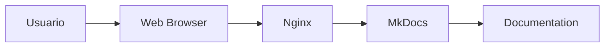

# Oracle Knowledge Base

-   :material-database:{ .lg .middle } **Oracle Database**

    ---

    Administración, SQL, performance y troubleshooting.

    [:octicons-arrow-right-24: Ir a sección](02_oracle_database/)

-   :material-server:{ .lg .middle } **Oracle EBS**

    ---

    Oracle E-Business Suite R12.

    Concurrent Programs, APIs, Forms y configuración.

    [:octicons-arrow-right-24: Ir a sección](03_ebs/)

-   :material-file-code:{ .lg .middle } **PL/SQL**

    ---

    Packages, procedimientos, triggers y optimización.

    [:octicons-arrow-right-24: Ir a sección](08_plsql/)

-   :material-linux:{ .lg .middle } **Linux**

    ---

    Administración de servidores Oracle.

    [:octicons-arrow-right-24: Ir a sección](09_linux/)

---

## Bienvenido

Base de conocimiento técnica para:

- Oracle EBS 12.2
- Oracle Database
- Oracle Forms
- BI Publisher
- SQL
- PL/SQL
- Linux
- SAP

---

## Arquitectura

---

## Estado del proyecto

| Módulo | Estado |
|-|-|
| Plataforma | 🟢 Activa |
| Oracle EBS | 🟡 En construcción |
| Forms | 🟡 En construcción |
| BI Publisher | 🟡 En construcción |
| Linux | 🟢 Disponible |
