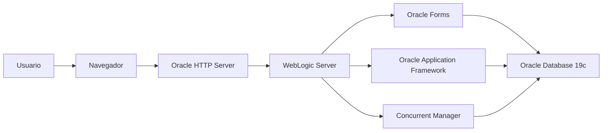
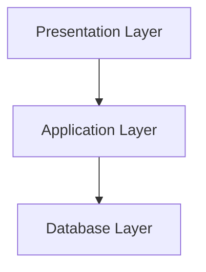
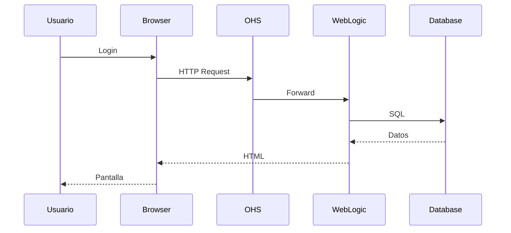
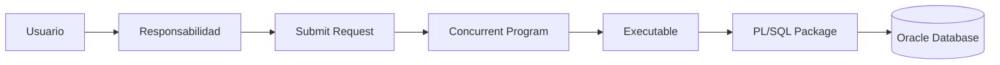
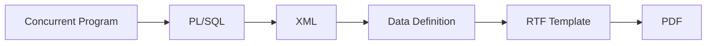
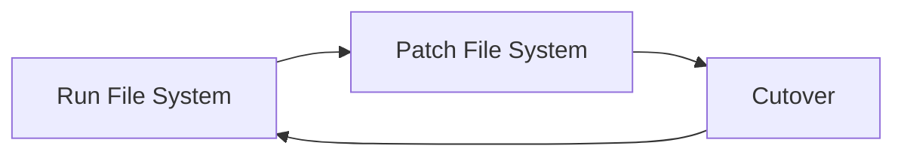

# Arquitectura Oracle E-Business Suite R12.2

> Descripción de la arquitectura de Oracle E-Business Suite R12.2, sus componentes principales y el flujo de comunicación entre ellos.

---

## Objetivo

Comprender cómo interactúan los diferentes componentes de Oracle EBS para facilitar el desarrollo, la administración y la solución de problemas.

---

# Arquitectura General



---

# Componentes Principales

## Oracle HTTP Server (OHS)

Responsable de recibir las solicitudes HTTP y HTTPS provenientes de los usuarios.

Funciones:

- Balanceo de carga
- SSL
- Proxy hacia WebLogic
- Gestión de sesiones

---

## Oracle WebLogic Server

Servidor de aplicaciones donde se ejecutan los servicios de Oracle EBS.

Entre ellos:

- Oracle Forms
- OAF
- Java
- Servicios Web

---

## Oracle Forms

Tecnología utilizada para las pantallas tradicionales de Oracle EBS.

Características:

- Desarrollo en Oracle Forms Builder
- Integración con PL/SQL
- Acceso directo a la base de datos

---

## Oracle Application Framework (OAF)

Framework basado en Java utilizado para las pantallas web modernas.

---

## Concurrent Manager

Ejecuta procesos en segundo plano.

Ejemplos:

- Reportes
- Interfaces
- XML Publisher
- Procesos Batch

---

## Oracle Database

Motor de base de datos donde residen:

- Datos de negocio
- Objetos APPS
- Paquetes PL/SQL
- Triggers
- Views
- Sinónimos

---

# Capas de Oracle EBS



| Capa | Componentes |
|------|-------------|
| Presentation | Browser, Oracle Forms, OAF |
| Application | WebLogic, Concurrent Manager, Services |
| Database | Oracle Database, APPS Schema |

---

# Flujo de una solicitud



---

# Arquitectura de un Concurrent Program



---

# Arquitectura XML Publisher



---

# Sistema de Archivos

```text
EBSapps/

├── appl/
├── fs1/
├── fs2/
├── fs_ne/
├── inst/
└── logs/
```

## Descripción

| Directorio | Uso |
|------------|-----|
| fs1 | File System de ejecución |
| fs2 | File System alterno para Online Patching |
| fs_ne | File System no editable |
| appl | Productos Oracle |
| inst | Archivos de configuración |
| logs | Logs del sistema |

---

# Online Patching (ADOP)



Fases principales:

- prepare
- apply
- finalize
- cutover
- cleanup

---

# Esquemas más utilizados

| Esquema | Descripción |
|---------|-------------|
| APPS | Objetos de aplicación |
| SYS | Administración de Oracle |
| SYSTEM | Administración |
| XXCUS | Objetos personalizados |
| APPLSYS | Foundation |

---

# Variables de entorno

```bash
echo $APPL_TOP
echo $COMMON_TOP
echo $FND_TOP
echo $ORACLE_HOME
echo $CONTEXT_FILE
```

---

# Buenas prácticas

!!! tip "Recomendaciones"

    - No modificar objetos estándar de Oracle.
    - Utilizar esquemas personalizados (XX, XXCUS, etc.).
    - Versionar desarrollos en Git.
    - Documentar dependencias entre componentes.
    - Aprovechar ADOP para despliegues en R12.2.

---

# Referencias

- Oracle E-Business Suite Concepts Guide
- Oracle E-Business Suite System Administrator's Guide
- Oracle E-Business Suite Developer's Guide