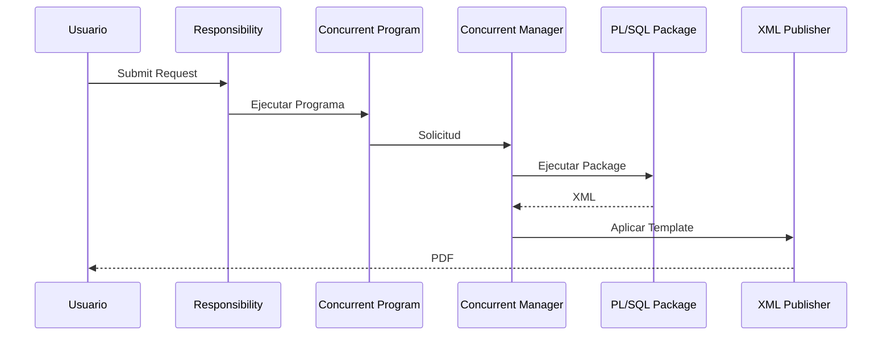

# Concurrent Programs

> Guía completa para crear, registrar, administrar y solucionar problemas de programas concurrentes en Oracle E-Business Suite R12.2.

---

## Objetivo

En esta guía aprenderás:

- Qué es un Concurrent Program.
- Cómo funciona el Concurrent Manager.
- Cómo registrar un Executable.
- Cómo crear un Concurrent Program.
- Cómo asociar parámetros y Value Sets.
- Cómo generar reportes mediante XML Publisher.
- Cómo solucionar los errores más comunes.

---

## ¿Qué es un Concurrent Program?

Un **Concurrent Program** es un proceso que Oracle E-Business Suite ejecuta en segundo plano mediante el **Concurrent Manager**.

Este mecanismo permite ejecutar tareas de larga duración sin bloquear la sesión del usuario.

Ejemplos:

- Reportes
- Interfaces
- Procesos Batch
- XML Publisher
- BI Publisher
- Importaciones
- Exportaciones

---

## Arquitectura


---

## Componentes

### Concurrent Program

Representa el proceso disponible para el usuario.

Contiene:

- Executable
- Parámetros
- Value Sets
- Método de salida
- Incompatibilidades

---

### Executable

Define qué ejecutará Oracle.

Tipos más utilizados:

| Tipo | Descripción |
|-------|-------------|
| PL/SQL Stored Procedure | Ejecuta un procedimiento almacenado |
| Host | Ejecuta un script del sistema operativo |
| Java Stored Procedure | Ejecuta código Java |
| SQL*Plus | Ejecuta scripts SQL |
| SQL Loader | Carga archivos hacia Oracle |

---

### Concurrent Manager

Servicio encargado de ejecutar los procesos.

Funciones principales:

- Administrar colas
- Balancear carga
- Ejecutar procesos
- Registrar logs
- Generar archivos de salida

---

## Flujo de ejecución



---

# Creación de un Concurrent Program

## Paso 1. Crear el Executable

**Ruta**

```text
Application Developer

↓

Concurrent

↓

Executable
```

Completar:

| Campo | Valor |
|--------|-------|
| Executable | XXCUST_CUSTOMER_XML |
| Short Name | XXCCUSTXML |
| Method | PL/SQL Stored Procedure |
| Execution File | XXCUST_CUSTOMER_XML_PKG |

---

## Paso 2. Crear el Concurrent Program

**Ruta**

```text
Application Developer

↓

Concurrent

↓

Program
```

Configurar:

| Campo | Valor |
|--------|-------|
| Program | XX Customer Report |
| Executable | XXCUST_CUSTOMER_XML |
| Output | XML |

---

## Paso 3. Definir Parámetros

Ejemplo:

| Parámetro | Value Set |
|-----------|-----------|
| Customer Number | XX_CUSTOMER_VS |
| Status | FND_STANDARD_YES_NO |

---

## Ejemplo práctico

Durante esta documentación utilizaremos el reporte desarrollado anteriormente.

```
XXCUST_CUSTOMER_XML_TEST
```

Flujo:


---

# APIs

## Registrar un Concurrent Program

```plsql
FND_PROGRAM.REGISTER(...)
```

---

## Eliminar un Concurrent Program

```plsql
FND_PROGRAM.DELETE_PROGRAM(...)
```

---

## Eliminar un Executable

```plsql
FND_PROGRAM.DELETE_EXECUTABLE(...)
```

---

# Consultas SQL

## Concurrent Programs

```sql
SELECT
       concurrent_program_name,
       user_concurrent_program_name,
       enabled_flag
FROM
       fnd_concurrent_programs_vl;
```

---

## Executables

```sql
SELECT
       executable_name,
       execution_method_code
FROM
       fnd_executables;
```

---

## Concurrent Requests

```sql
SELECT
       request_id,
       phase_code,
       status_code
FROM
       fnd_concurrent_requests
ORDER BY request_id DESC;
```

---

## Concurrent Managers

```sql
SELECT
       concurrent_queue_name,
       running_processes
FROM
       fnd_concurrent_queues_vl;
```

---

# Troubleshooting

## Request en estado Pending

Posibles causas:

- Concurrent Manager detenido.
- Incompatibilidades.
- Cola saturada.

---

## ORA-00904

**Causa**

Columna inválida.

**Solución**

- Verificar vistas APPS.
- Revisar sinónimos.
- Validar nombres de columnas.

---

## ORA-06501

**Causa**

Error interno del programa PL/SQL.

**Solución**

- Revisar el Package.
- Consultar el archivo Log.
- Utilizar FND_FILE para registrar mensajes.

---

## No genera PDF

Validar:

- Data Definition.
- Template RTF.
- XML generado.
- Bursting.
- Output Post Processor.

---

# Buenas prácticas

!!! tip "Recomendaciones"

    - Utilizar prefijo corporativo (**XX**, **XXCUST**, etc.).
    - Registrar mensajes mediante **FND_FILE**.
    - Separar la lógica en Packages.
    - Versionar el código en Git.
    - Documentar parámetros y dependencias.
    - Utilizar Value Sets para validar entradas.
    - Evitar SQL embebido en Oracle Forms.

---

# Laboratorio

## Objetivo

Crear un reporte XML Publisher desde cero.

### Actividades

- Crear Package PL/SQL.
- Registrar Executable.
- Registrar Concurrent Program.
- Crear Data Definition.
- Crear Template RTF.
- Generar XML.
- Generar PDF.

---

# Referencias

- Oracle E-Business Suite Developer Guide
- Oracle XML Publisher Developer Guide
- Oracle Concurrent Processing Guide