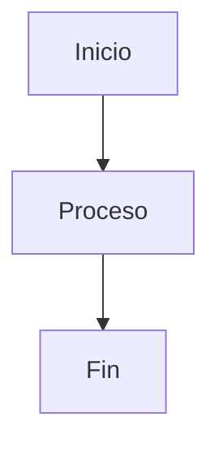

# Data Templates

## Objetivo

> Pendiente de documentar.

---

## Introducción

---

## Arquitectura



---

## Configuración

---

## Ejemplo

---

## Scripts

```sql
-- Pendiente
```

---

## Troubleshooting

| Error | Solución |
|--------|----------|
| Pendiente | Pendiente |

---

## Referencias

