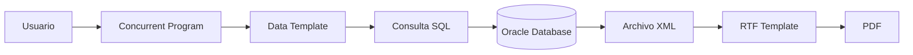
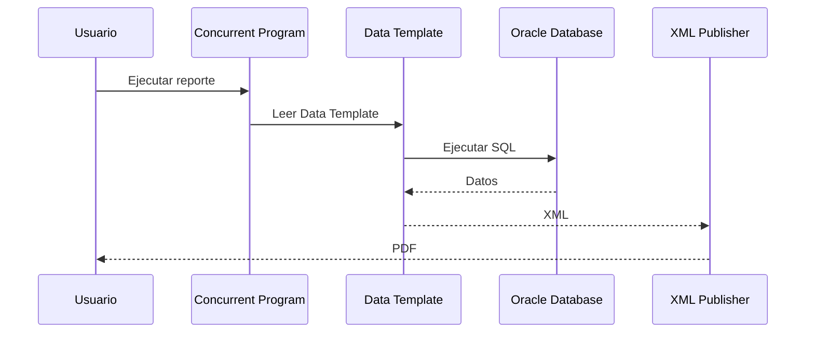
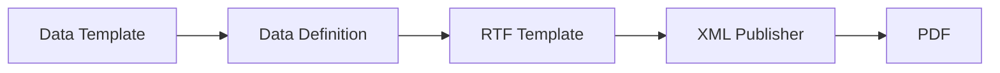

# Data Templates

> Guía para crear, registrar y utilizar Data Templates en Oracle E-Business Suite R12.2 con XML Publisher.

---

## Objetivo

Aprender a desarrollar Data Templates para generar documentos XML que posteriormente serán transformados por XML Publisher en formatos como PDF, Excel, RTF, HTML o CSV.

---

# ¿Qué es un Data Template?

Un **Data Template** es un archivo XML que define:

- Parámetros de entrada.
- Consulta(s) SQL.
- Estructura del XML generado.
- Grupos de datos.
- Elementos del reporte.

El Data Template actúa como la fuente de datos para XML Publisher.

---

# Arquitectura



---

# Flujo de ejecución



---

# Estructura de un Data Template

```xml
<dataTemplate
    name="XXCUST_CUSTOMER_RPT"
    version="1.0">

    <parameters>

    </parameters>

    <dataQuery>

    </dataQuery>

    <dataStructure>

    </dataStructure>

</dataTemplate>
```

---

# Parámetros

```xml
<parameters>

    <parameter
        name="P_STATUS"
        dataType="VARCHAR2"/>

</parameters>
```

También pueden declararse parámetros numéricos, fechas y otros tipos compatibles.

---

# Data Query

```xml
<dataQuery>

    <sqlStatement name="Q_CUSTOMERS">

        <![CDATA[

        SELECT
               party_id,
               party_name,
               status
        FROM
               hz_parties
        WHERE
               status = :P_STATUS

        ]]>

    </sqlStatement>

</dataQuery>
```

---

# Data Structure

```xml
<dataStructure>

    <group
        name="G_CUSTOMERS"
        source="Q_CUSTOMERS">

        <element
            name="PARTY_ID"
            value="party_id"/>

        <element
            name="PARTY_NAME"
            value="party_name"/>

        <element
            name="STATUS"
            value="status"/>

    </group>

</dataStructure>
```

---

# XML generado

```xml
<DATA_DS>

    <G_CUSTOMERS>

        <PARTY_ID>1001</PARTY_ID>

        <PARTY_NAME>ACME CORPORATION</PARTY_NAME>

        <STATUS>A</STATUS>

    </G_CUSTOMERS>

</DATA_DS>
```

---

# Registro en Oracle EBS

Ruta:

```text
Application Developer

↓

Data Definitions
```

Configurar:

| Campo | Valor |
|--------|-------|
| Code | XXCUST_CUSTOMER_RPT |
| Application | XXCUS |
| Start Date | Fecha actual |
| Data Template | XXCUST_CUSTOMER_RPT.xml |

---

# Asociación con XML Publisher



---

# Ejemplo completo

Nuestro laboratorio utiliza el siguiente flujo:

```text
XXCUST_CUSTOMER_XML_TEST

↓

Data Template

↓

Consulta HZ_PARTIES

↓

XML

↓

RTF

↓

PDF
```

---

# Buenas prácticas

!!! tip "Recomendaciones"

    - Utilizar nombres con prefijo corporativo (XX, XXCUS, etc.).
    - Mantener una única responsabilidad por Data Template.
    - Escribir consultas SQL legibles y optimizadas.
    - Definir nombres de grupos y elementos descriptivos.
    - Evitar lógica compleja dentro del SQL cuando pueda resolverse en un paquete PL/SQL.
    - Versionar el archivo XML junto con el código fuente.

---

# Errores frecuentes

## XML vacío

**Posibles causas**

- La consulta no devuelve registros.
- Parámetros incorrectos.
- Error en el filtro SQL.

---

## ORA-00904

**Causa**

Nombre de columna inválido.

**Solución**

- Validar la consulta directamente en SQL Developer.
- Confirmar que las columnas existen en la vista o tabla utilizada.

---

## ORA-06502

**Causa**

Conversión o longitud de datos incorrecta.

**Solución**

- Revisar tipos de datos.
- Validar conversiones de fecha y número.

---

## No se genera el PDF

Verificar:

- Data Definition.
- Template RTF.
- Asociación entre Data Definition y Template.
- Output Post Processor.
- Concurrent Program.

---

# Laboratorio

## Objetivo

Crear un reporte de clientes utilizando:

- Data Template.
- XML Publisher.
- Concurrent Program.
- Template RTF.
- Salida en PDF.

---

# Referencias

- Oracle XML Publisher Developer's Guide.
- Oracle E-Business Suite Developer's Guide.
- Oracle XML Publisher Report Designer's Guide.