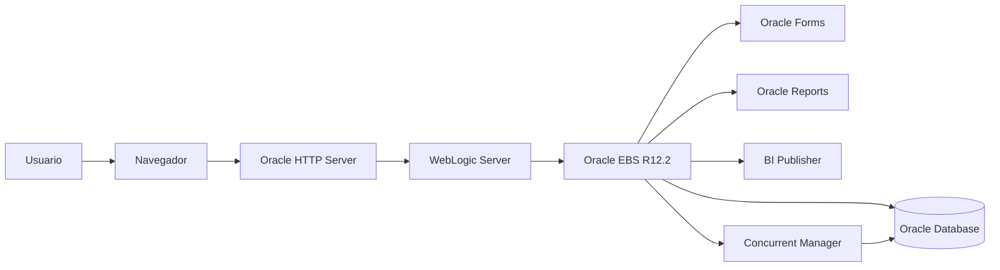
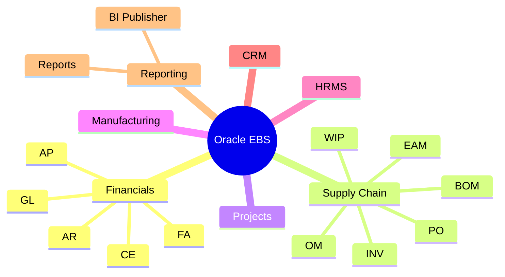
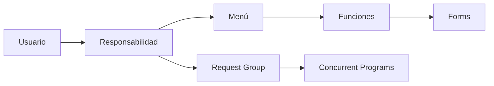

# Oracle E-Business Suite R12.2

> Base de conocimiento técnica para administración, desarrollo y soporte Oracle E-Business Suite R12.2.

---

# Introducción

Oracle E-Business Suite (EBS) es una plataforma empresarial integrada que proporciona módulos para:

- Finanzas.
- Compras.
- Inventarios.
- Ventas.
- Manufactura.
- Recursos Humanos.
- Reportes.
- Integraciones.

Esta sección documenta tareas de:

- Desarrollo.
- Administración.
- Personalización.
- Soporte L2/L3.
- Troubleshooting.

---

# Arquitectura Oracle EBS



---

# Componentes principales

| Componente | Descripción |
|-|-|
| Oracle Database | Almacena información EBS |
| APPS Schema | Capa lógica de aplicaciones |
| Forms | Interfaces Oracle Forms |
| WebLogic | Middleware Java |
| OHS | Servidor HTTP |
| Concurrent Manager | Procesamiento batch |
| BI Publisher | Reportes XML/PDF |

---

# Módulos funcionales



---

# Desarrollo Oracle EBS

## Base de datos

Documentación:

- SQL.
- PL/SQL.
- Packages.
- Procedures.
- Triggers.
- Views.

Archivos:

- [SQL Scripts](sql_scripts.md)
- [PL/SQL Packages](packages.md)

---

# Objetos personalizados

Estándar recomendado:

```
XXCUS_OBJECT_NAME
```

Ejemplos:

```
XXCUS_CUSTOMER_PKG

XXCUS_CUSTOMER_REPORT

XXCUS_CUSTOMER_TABLE
```

---

# Concurrent Processing

El motor de ejecución batch de Oracle EBS.

Componentes:

```
Executable

      |

Concurrent Program

      |

Request Group

      |

Responsibility

      |

Usuario
```

Documentación:

- [Executables](executables.md)
- [Concurrent Programs](concurrent_programs.md)
- [Request Groups](request_groups.md)
- [Request Sets](request_sets.md)

---

# Seguridad Oracle EBS

Modelo:



Documentación:

- [Responsibilities](responsibilities.md)
- [Profiles](profiles.md)
- [Lookups](lookups.md)
- [Value Sets](value_sets.md)

---

# Oracle Forms

Desarrollo de interfaces:

Incluye:

- Forms Builder.
- Triggers.
- Personalizaciones.
- Libraries.
- Integración con EBS.

Documentación:

- [Forms Development](../04_forms/index.md)
- [Personalizations](personalizations.md)

---

# Reportes

Tecnologías:

## Oracle Reports

```
.rdf
```

## BI Publisher

```
XML

+

RTF

=

PDF
```

Documentación:

- [XML Publisher](../06_bipublisher/xml_publisher.md)
- [RTF Templates](../06_bipublisher/rtf_templates.md)

---

# Interfaces

Oracle EBS se integra mediante:

- APIs.
- Open Interfaces.
- Web Services.
- XML Gateway.
- ETL.
- Archivos planos.

Documentación:

- [APIs](apis.md)

---

# APIs Oracle EBS

Ejemplo:

```plsql
BEGIN

FND_GLOBAL.APPS_INITIALIZE
(
 user_id      => 1234,
 resp_id      => 56789,
 resp_appl_id => 200
);

END;
/
```

Uso:

- Carga de datos.
- Integraciones.
- Automatización.

---

# Administración

Tareas comunes:

- Usuarios.
- Responsabilidades.
- Perfiles.
- Concurrent Managers.
- Migraciones.

---

# Migraciones

Herramientas:

| Herramienta | Uso |
|-|-|
| FNDLOAD | Configuración EBS |
| SQL Scripts | Objetos BD |
| Git | Control versiones |
| AD utilities | Administración |

---

# Troubleshooting

Metodología:

```text
Usuario

 |

Aplicación

 |

Middleware

 |

Base de Datos

 |

Sistema Operativo
```

Documentación:

- [Troubleshooting Oracle EBS](../13_troubleshooting/oracle_ebs.md)

---

# Laboratorios

Ejercicios prácticos:

- Crear Concurrent Program.
- Crear Value Set.
- Crear Request Set.
- Crear reporte XML Publisher.
- Crear API PL/SQL.
- Crear personalización Forms.

---

# Estructura del repositorio

```
03_ebs/

├── index.md

├── responsibilities.md

├── profiles.md

├── lookups.md

├── value_sets.md

├── request_groups.md

├── request_sets.md

├── concurrent_programs.md

├── executables.md

├── apis.md

├── sql_scripts.md

└── troubleshooting.md
```

---

# Checklist Desarrollo EBS

- [ ] Crear aplicación personalizada.
- [ ] Crear objetos BD.
- [ ] Crear paquetes PL/SQL.
- [ ] Crear Value Sets.
- [ ] Crear Lookups.
- [ ] Crear Concurrent Program.
- [ ] Crear Responsibility.
- [ ] Crear Request Group.
- [ ] Crear Reporte.
- [ ] Documentar migración.

---

# Referencias

- Oracle E-Business Suite Documentation.
- Oracle Application Object Library Developer Guide.
- Oracle Concurrent Processing Guide.
- Oracle BI Publisher User Guide.