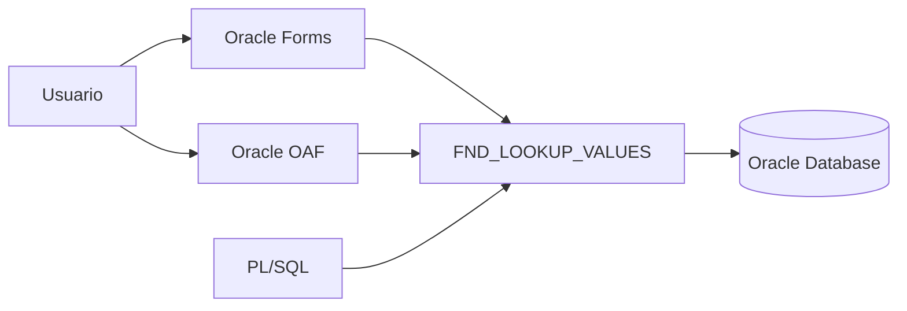
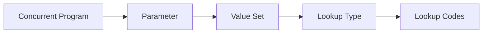

# Lookups en Oracle E-Business Suite

> Guía para crear, consultar y utilizar Lookups en Oracle E-Business Suite R12.2.

---

## Objetivo

Comprender el funcionamiento de los Lookups en Oracle EBS y aprender a:

- Crear Lookups personalizados.
- Definir valores.
- Consultar Lookups desde SQL.
- Utilizarlos en Forms, OAF y PL/SQL.
- Aplicar buenas prácticas.

---

# ¿Qué es un Lookup?

Un **Lookup** es una lista de valores predefinidos utilizada por Oracle EBS para representar opciones de negocio.

Los Lookups permiten evitar valores codificados directamente en el código fuente.

Ejemplo:

En lugar de:

```sql
IF status = 'A' THEN
   ...
END IF;
```

Utilizar:

```text
XX_STATUS

ACTIVE   → Activo
INACTIVE → Inactivo
```

---

# Arquitectura



---

# Tipos de Lookups

Oracle EBS maneja principalmente:

| Tipo | Descripción |
|------|-------------|
| System Lookup | Creado y mantenido por Oracle |
| User Lookup | Permite mantenimiento por usuarios |
| Extensible Lookup | Puede extenderse con nuevos valores |

---

# Componentes de un Lookup

Un Lookup está formado por:

| Elemento | Descripción |
|----------|-------------|
| Lookup Type | Código del Lookup |
| Lookup Code | Valor interno |
| Meaning | Descripción visible |
| Description | Información adicional |
| Enabled Flag | Disponible o no |
| Start Date | Fecha inicio |
| End Date | Fecha fin |

---

# Crear un Lookup

Ruta:

```text
Application Developer

↓

Application

↓

Lookups
```

---

## Ejemplo

Crear Lookup:

```
Lookup Type:

XX_CUSTOMER_STATUS
```

Valores:

| Código | Meaning |
|--------|---------|
| ACTIVE | Activo |
| INACTIVE | Inactivo |
| BLOCKED | Bloqueado |

---

# Estructura en Base de Datos

La información se almacena principalmente en:

```sql
FND_LOOKUP_VALUES
```

Vista recomendada:

```sql
FND_LOOKUP_VALUES_VL
```

---

# Consultar Lookups

## Consulta básica

```sql
SELECT
       lookup_type,
       lookup_code,
       meaning,
       enabled_flag
FROM
       fnd_lookup_values_vl
WHERE
       lookup_type = 'XX_CUSTOMER_STATUS';
```

---

## Consultar solamente valores activos

```sql
SELECT
       lookup_code,
       meaning
FROM
       fnd_lookup_values_vl
WHERE
       lookup_type = 'XX_CUSTOMER_STATUS'
AND
       enabled_flag = 'Y';
```

---

# Uso en PL/SQL

## Obtener Meaning de un Lookup

```plsql
DECLARE

    l_meaning VARCHAR2(100);

BEGIN

    SELECT meaning
    INTO l_meaning
    FROM fnd_lookup_values_vl
    WHERE lookup_type = 'XX_CUSTOMER_STATUS'
    AND lookup_code = 'ACTIVE';

END;
/
```

---

# Uso mediante API

Oracle proporciona paquetes de consulta para algunos escenarios.

Ejemplo:

```plsql
FND_LOOKUP_VALUES
```

---

# Uso en Oracle Forms

Los Lookups pueden utilizarse como:

- List of Values (LOV).
- Validaciones de campo.
- Valores por defecto.

Ejemplo:

```text
STATUS

[ACTIVE]
[INACTIVE]
[BLOCKED]
```

---

# Uso en Concurrent Programs

Los Lookups frecuentemente son utilizados mediante Value Sets.

Ejemplo:

```text
Concurrent Program

       |
       |
       v

Parameter

       |
       |
       v

Value Set

       |
       |
       v

Lookup Values
```

---

# Relación Lookup - Value Set



---

# Ejemplo práctico

## Lookup

```text
XX_ORDER_STATUS
```

Valores:

| Código | Meaning |
|--------|---------|
| NEW | Nuevo |
| PROC | Procesado |
| CLOSE | Cerrado |

---

## Consulta

```sql
SELECT
       lookup_code,
       meaning
FROM
       fnd_lookup_values_vl
WHERE
       lookup_type = 'XX_ORDER_STATUS';
```

Resultado:

| LOOKUP_CODE | MEANING |
|-|-|
| NEW | Nuevo |
| PROC | Procesado |
| CLOSE | Cerrado |

---

# Errores frecuentes

## No aparecen valores

Revisar:

- Enabled Flag.
- Fechas de vigencia.
- Idioma.
- Lookup Type correcto.

---

## Valor no disponible en LOV

Validar:

```sql
SELECT *
FROM fnd_lookup_values_vl
WHERE lookup_type='XX_CUSTOMER_STATUS';
```

---

## Lookup deshabilitado

Verificar:

```sql
enabled_flag = 'Y'
```

---

# Buenas prácticas

!!! tip "Recomendaciones"

    - Utilizar prefijo corporativo (XX, XXCUS).
    - No modificar Lookups estándar de Oracle.
    - Documentar el propósito del Lookup.
    - Usar códigos cortos y descriptivos.
    - Controlar fechas de vigencia.
    - Evitar valores codificados en PL/SQL.
    - Versionar los Lookups personalizados.

---

# Scripts útiles

## Exportar valores de un Lookup

```sql
SELECT
       lookup_type,
       lookup_code,
       meaning,
       description
FROM
       fnd_lookup_values_vl
WHERE
       lookup_type LIKE 'XX%';
```

---

## Buscar Lookups personalizados

```sql
SELECT DISTINCT
       lookup_type
FROM
       fnd_lookup_values_vl
WHERE
       lookup_type LIKE 'XX%';
```

---

# Laboratorio

## Crear Lookup personalizado

Objetivo:

Crear un Lookup para controlar estados de clientes.

Actividades:

- Crear Lookup Type.
- Agregar valores.
- Crear Value Set basado en Lookup.
- Asociarlo a Concurrent Program.
- Validar desde SQL.

---

# Referencias

- Oracle E-Business Suite Application Object Library Developer's Guide.
- Oracle EBS System Administrator's Guide.