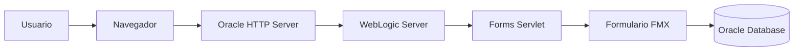
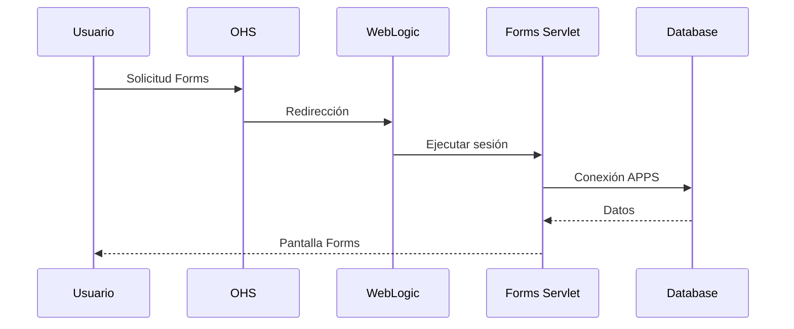
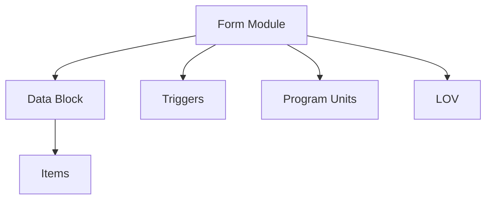
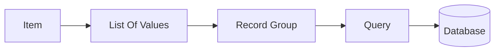

# Oracle Forms en Oracle E-Business Suite

> Guía de desarrollo, personalización y administración de Oracle Forms dentro de Oracle E-Business Suite R12.2.

---

# Objetivo

Comprender el desarrollo de Oracle Forms en Oracle EBS y conocer:

- Arquitectura de Forms.
- Componentes de un formulario.
- Desarrollo con Forms Builder.
- Integración con APPS.
- Personalizaciones.
- Librerías PL/SQL.
- LOVs y Record Groups.
- Triggers.
- Compilación y despliegue.

---

# Introducción

Oracle Forms es una tecnología utilizada por Oracle E-Business Suite para construir pantallas transaccionales.

En EBS R12.2 continúa siendo utilizado para módulos tradicionales como:

- Receivables (AR)
- Payables (AP)
- Purchasing (PO)
- Inventory (INV)
- Order Management (OM)
- Manufacturing (WIP/BOM)

---

# Arquitectura Oracle Forms



---

# Flujo de ejecución



---

# Componentes de Oracle Forms

## Form Module (.fmb)

Archivo fuente editable desde Forms Builder.

Contiene:

- Blocks
- Items
- Triggers
- Program Units
- LOVs
- Canvases
- Windows

---

## Compiled Form (.fmx)

Archivo generado después de compilar.

Ejemplo:

```
XXCUSTOMER.fmb

        |
        |
        v

XXCUSTOMER.fmx
```

---

## Object Library (.olb)

Biblioteca reutilizable de objetos.

Ejemplos:

- Botones estándar.
- Canvas.
- LOVs.
- Triggers.

---

## PL/SQL Library (.pll)

Código reutilizable.

Ejemplo:

```
CUSTOM.pll
APP_STANDARD.pll
APPDAYPKG.pll
```

---

# Estructura de un Formulario EBS



---

# Integración con Oracle EBS

Oracle Forms utiliza librerías estándar:

## APP_STANDARD

Funciones comunes de Oracle EBS.

Ejemplo:

```plsql
APP_STANDARD.EVENT
(
    event_name
);
```

---

## APP_ITEM_PROPERTY

Modificar propiedades de objetos.

Ejemplo:

```plsql
APP_ITEM_PROPERTY.SET_PROPERTY
(
    'BLOCK.ITEM',
    ALTERABLE,
    PROPERTY_TRUE
);
```

---

## APP_FIELD

Validaciones y mensajes.

---

# Triggers principales

## WHEN-NEW-FORM-INSTANCE

Se ejecuta al abrir el formulario.

Ejemplo:

```plsql
BEGIN

    FND_MESSAGE.SET_NAME
    (
       'XXCUS',
       'FORM_OPEN'
    );

END;
```

---

## WHEN-BUTTON-PRESSED

Ejecuta acciones de botones.

Ejemplo:

```plsql
BEGIN

    GO_BLOCK('CUSTOMERS');

END;
```

---

## PRE-INSERT

Ejecutado antes de insertar registros.

Ejemplo:

```plsql
BEGIN

    :CUSTOMER.CREATED_BY :=
        FND_GLOBAL.USER_ID;

END;
```

---

# Navegación Forms

Funciones comunes:

| Función | Uso |
|-|-|
| GO_BLOCK | Cambiar bloque |
| GO_ITEM | Ir a campo |
| NEXT_RECORD | Siguiente registro |
| CLEAR_FORM | Limpiar formulario |
| EXECUTE_QUERY | Ejecutar consulta |

Ejemplo:

```plsql
GO_BLOCK('XX_CUSTOMERS');

EXECUTE_QUERY;
```

---

# LOV (List of Values)

Permite seleccionar valores desde una lista.

Arquitectura:



---

# Personalización de Forms

Oracle EBS permite modificar comportamiento sin modificar el estándar.

Tipos:

- Personalizations
- CUSTOM.pll
- Forms Personalization Rules

---

# CUSTOM.pll

Archivo utilizado para extender comportamiento.

Ubicación:

```bash
$AU_TOP/resource/CUSTOM.pll
```

Ejemplo:

```plsql
BEGIN

IF
    event_name = 'WHEN-NEW-FORM-INSTANCE'
THEN

    NULL;

END IF;

END;
```

---

# Compilación

## Desde Linux

Ejemplo:

```bash
frmcmp_batch \
module=XXCUSTOMER.fmb \
userid=apps/password \
output_file=XXCUSTOMER.fmx
```

---

# Archivos importantes

| Archivo | Descripción |
|-|-|
| .fmb | Fuente Forms |
| .fmx | Ejecutable Forms |
| .pll | Librería PL/SQL |
| .olb | Librería objetos |
| .mmb | Menú Forms |

---

# Ubicaciones comunes EBS

Ejemplo:

```text
$AU_TOP/forms/US

$XXCUS_TOP/forms/US
```

---

# Variables de entorno

```bash
echo $AU_TOP

echo $XXCUS_TOP

echo $FORMS_PATH
```

---

# Troubleshooting

## FRM-40735

Error en trigger.

Validar:

- Trigger afectado.
- Código PL/SQL.
- Log de Forms.

---

## FRM-92101

Error de conexión Forms.

Revisar:

- WebLogic.
- Forms Servlet.
- Red.
- Listener.

---

## APP-FND-01564

Error de base de datos.

Validar:

- SQL.
- Grants.
- Sinónimos.
- Paquetes APPS.

---

# Buenas prácticas

!!! tip "Desarrollo Oracle Forms"

    - Nunca modificar Forms estándar directamente.
    - Crear extensiones en esquema personalizado.
    - Utilizar CUSTOM.pll o Forms Personalizations.
    - Versionar archivos FMB y PLL en Git.
    - Documentar triggers personalizados.
    - Mantener separación entre estándar y custom.

---

# Laboratorio

## Desarrollo de formulario personalizado

Objetivo:

Crear un formulario de clientes.

Actividades:

- Crear FMB.
- Crear bloque basado en tabla.
- Crear LOV.
- Agregar validaciones.
- Crear Package PL/SQL.
- Compilar FMX.
- Registrar menú y responsabilidad.

---

# Referencias

- Oracle Forms Developer Guide.
- Oracle E-Business Suite Developer's Guide.
- Oracle Applications User Interface Standards.