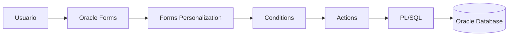

# Oracle Forms Personalizations en Oracle E-Business Suite

> Guía para extender y modificar el comportamiento de Oracle Forms en Oracle E-Business Suite R12.2 utilizando Forms Personalizations, sin modificar código estándar de Oracle.

---

# Objetivo

Aprender a utilizar Forms Personalizations para:

- Modificar comportamiento de Forms.
- Ocultar o mostrar campos.
- Cambiar propiedades de objetos.
- Ejecutar código PL/SQL.
- Validar información.
- Reemplazar modificaciones directas al estándar.

---

# ¿Qué es Forms Personalization?

Forms Personalization es una funcionalidad de Oracle EBS que permite cambiar el comportamiento de un formulario estándar mediante reglas configurables.

Permite realizar cambios sin modificar:

- Archivos `.fmb` estándar.
- Librerías Oracle.
- Código fuente de Oracle.

---

# Ventajas

| Característica | Beneficio |
|-|-|
| No modifica estándar | Facilita upgrades |
| Configurable | No requiere recompilar Forms |
| Control por responsabilidad | Permite diferentes comportamientos |
| Basado en reglas | Fácil mantenimiento |

---

# Arquitectura



---

# Componentes de una Personalización

Una regla está formada por:

```
Personalization

    |
    +-- Trigger Event

    |
    +-- Condition

    |
    +-- Action
```

---

# Trigger Event

Define cuándo se ejecutará la regla.

Ejemplos:

| Evento | Descripción |
|-|-|
| WHEN-NEW-FORM-INSTANCE | Al abrir formulario |
| WHEN-NEW-BLOCK-INSTANCE | Al entrar a bloque |
| WHEN-NEW-ITEM-INSTANCE | Al entrar a campo |
| WHEN-VALIDATE-ITEM | Validación de campo |
| WHEN-BUTTON-PRESSED | Presionar botón |

---

# Conditions

Define cuándo aplica la regla.

Ejemplos:

## Por usuario

```sql
FND_GLOBAL.USER_ID = 1234
```

---

## Por responsabilidad

```sql
FND_GLOBAL.RESP_ID = 50739
```

---

## Por valor de campo

```sql
:HEADER.STATUS = 'CLOSED'
```

---

# Actions

Define qué hará la personalización.

Tipos:

| Acción | Uso |
|-|-|
| Property | Cambiar propiedades |
| Message | Mostrar mensajes |
| Builtin | Ejecutar comandos Forms |
| PL/SQL | Ejecutar código |

---

# Ejemplo 1: Mostrar mensaje al abrir formulario

## Objetivo

Mostrar un aviso al usuario.

Evento:

```
WHEN-NEW-FORM-INSTANCE
```

Acción:

Tipo:

```
Message
```

Mensaje:

```
Bienvenido al formulario de clientes
```

---

# Ejemplo 2: Deshabilitar un campo

## Objetivo

Bloquear modificación del cliente.

Evento:

```
WHEN-NEW-ITEM-INSTANCE
```

Condición:

```sql
:AR_CUSTOMERS.STATUS = 'INACTIVE'
```

Acción:

```
Property
```

Objeto:

```
CUSTOMER.NAME
```

Propiedad:

```
UPDATE_ALLOWED = FALSE
```

---

# Ejemplo 3: Ejecutar PL/SQL

Evento:

```
WHEN-BUTTON-PRESSED
```

Acción:

```
PL/SQL
```

Código:

```plsql
BEGIN

    FND_MESSAGE.SET_NAME
    (
       'XXCUS',
       'CUSTOMER_WARNING'
    );

    FND_MESSAGE.SHOW;

END;
```

---

# Niveles de Personalización

Oracle evalúa las reglas según:

```text
Oracle Forms

      |
      |
      +-- Function
      |
      +-- Responsibility
      |
      +-- User
```

---

# Prioridad

Orden recomendado:

```text
Usuario

↓

Responsabilidad

↓

Función

↓

Sitio
```

---

# Consultas SQL

## Consultar personalizaciones

```sql
SELECT
       fup.function_name,
       fup.description
FROM
       fnd_form_custom_rules fcr,
       fnd_form_functions fup
WHERE
       fcr.function_id = fup.function_id;
```

---

# Migración entre ambientes

Las personalizaciones deben transportarse entre:

```text
DESARROLLO

        |

        v

QA

        |

        v

PRODUCCIÓN
```

Métodos:

- FNDLOAD
- Migración manual documentada
- Control de versiones

---

# FNDLOAD

Ejemplo exportación:

```bash
FNDLOAD apps/password \
0 Y DOWNLOAD \
$FND_TOP/patch/115/import/afsload.lct \
XX_CUSTOM_PERSONALIZATION.ldt \
FND_FORM_CUSTOM_RULES \
FUNCTION_NAME=XX_FUNCTION
```

---

# Buenas prácticas

!!! tip "Recomendaciones"

    - Nunca modificar Forms estándar.
    - Utilizar Forms Personalization antes que CUSTOM.pll.
    - Documentar cada regla creada.
    - Agregar nombres descriptivos.
    - Controlar versiones con Git.
    - Probar siempre en ambiente QA.
    - Revisar impacto en upgrades.

---

# Forms Personalization vs CUSTOM.pll

| Característica | Forms Personalization | CUSTOM.pll |
|-|-|-|
| Código | Bajo | Alto |
| Mantenimiento | Fácil | Medio |
| Requiere compilación | No | Sí |
| Uso recomendado | Cambios simples | Lógica compleja |

---

# Troubleshooting

## La regla no se ejecuta

Validar:

- Evento correcto.
- Nivel de responsabilidad.
- Condición.
- Usuario.
- Estado Enabled.

---

## Error FRM-40735

Causa:

Error en PL/SQL ejecutado.

Revisar:

- Código PL/SQL.
- Package utilizado.
- Mensajes FND.

---

## Personalización perdida

Validar:

- Migración FNDLOAD.
- Ambiente correcto.
- Responsabilidad asociada.

---

# Laboratorio

## Crear una personalización de clientes

Objetivo:

Bloquear modificación de clientes inactivos.

Actividades:

- Identificar formulario.
- Crear regla.
- Definir evento.
- Crear condición.
- Aplicar propiedad.
- Probar con diferentes responsabilidades.

---

# Referencias

- Oracle E-Business Suite Developer's Guide.
- Oracle Applications User Interface Standards.
- Oracle Forms Personalization User Guide.