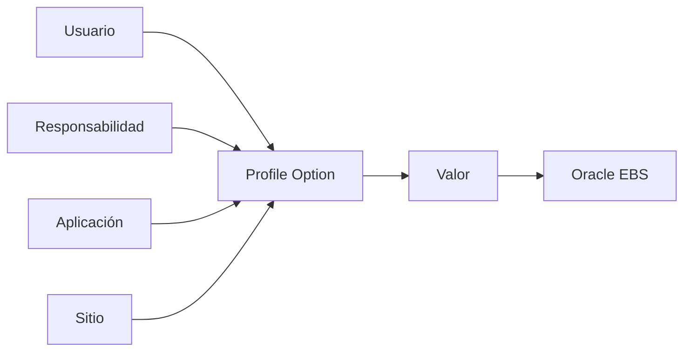
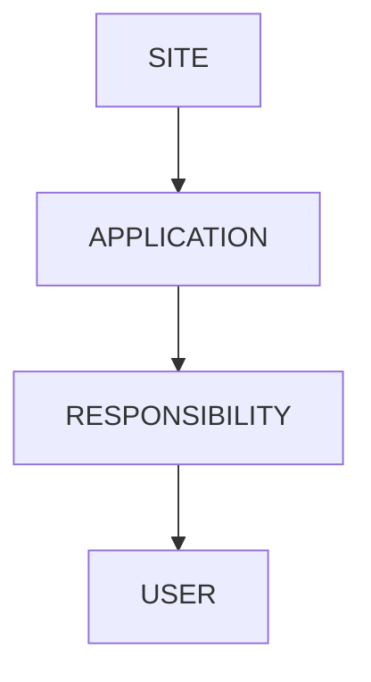

# Profile Options en Oracle E-Business Suite

> Guía para administrar, consultar y utilizar Profile Options en Oracle E-Business Suite R12.2.

---

# Objetivo

Comprender el funcionamiento de los Profile Options y aprender a:

- Crear perfiles personalizados.
- Asignar valores.
- Consultar perfiles desde SQL.
- Utilizarlos en PL/SQL.
- Aplicarlos en Forms y Concurrent Programs.
- Resolver problemas relacionados con configuración.

---

# ¿Qué es un Profile Option?

Un **Profile Option** es un parámetro configurable de Oracle EBS que permite controlar el comportamiento de la aplicación sin modificar código.

Los valores pueden depender del nivel donde se asignen:

- Sitio (Site)
- Aplicación (Application)
- Responsabilidad (Responsibility)
- Usuario (User)

---

# Arquitectura



---

# Niveles de asignación

Oracle EBS utiliza una jerarquía:



Orden de prioridad:

```text
Usuario

↓

Responsabilidad

↓

Aplicación

↓

Sitio
```

El valor más específico tiene prioridad.

---

# Ejemplos de Profile Options comunes

| Profile | Uso |
|-|-|
| ORG_ID | Organización actual |
| MO: Operating Unit | Unidad operativa |
| GL Set of Books Name | Libro contable |
| USER_ID | Usuario actual |
| RESP_ID | Responsabilidad actual |
| CONC_REQUEST_ID | Solicitud concurrente |
| FND: Debug Log Enabled | Activar debugging |
| Sign-On: Audit Level | Auditoría |

---

# Crear un Profile Option personalizado

Ruta:

```
Application Developer

↓

Profile

↓

Define
```

---

## Ejemplo

Crear:

```
XXCUS_ENABLE_FEATURE
```

Descripción:

```
Control de funcionalidad personalizada
```

SQL:

```text
Profile Name:

XXCUS_ENABLE_FEATURE
```

---

# Asignar valores

Ruta:

```
System Administrator

↓

Profile

↓

System
```

Buscar:

```
XXCUS_ENABLE_FEATURE
```

Seleccionar nivel:

- Site
- Application
- Responsibility
- User

Asignar valor:

```
Y
```

---

# Consultar Profile Options

Vista recomendada:

```sql
FND_PROFILE_OPTION_VALUES
```

---

## Buscar perfiles personalizados

```sql
SELECT
       profile_option_name,
       profile_option_value,
       level_id
FROM
       fnd_profile_option_values
WHERE
       profile_option_name LIKE 'XX%';
```

---

# Obtener un Profile desde PL/SQL

## FND_PROFILE.VALUE

Ejemplo:

```plsql
DECLARE

    l_org_id VARCHAR2(100);

BEGIN

    l_org_id :=
        FND_PROFILE.VALUE('ORG_ID');

END;
/
```

---

# Obtener valor de un perfil personalizado

```plsql
DECLARE

    l_value VARCHAR2(10);

BEGIN

    l_value :=
        FND_PROFILE.VALUE
        (
          'XXCUS_ENABLE_FEATURE'
        );

END;
/
```

---

# Inicialización de contexto

Cuando una API se ejecuta fuera de Oracle EBS se debe inicializar el contexto.

Ejemplo:

```plsql
BEGIN

FND_GLOBAL.APPS_INITIALIZE
(
    user_id      => 1234,
    resp_id      => 56789,
    resp_appl_id => 200
);

END;
/
```

Después:

```plsql
FND_PROFILE.VALUE('ORG_ID');
```

devolverá el valor correcto.

---

# Uso en Oracle Forms

Ejemplo:

```plsql
:BLOCK.ITEM :=
FND_PROFILE.VALUE('USER_ID');
```

---

# Uso en Concurrent Programs

Ejemplo:

Obtener la organización actual:

```plsql
l_org_id :=
FND_PROFILE.VALUE('ORG_ID');
```

---

# Profile Options y Multi-Org

Los perfiles más importantes:

| Profile | Función |
|-|-|
| MO: Operating Unit | Define OU |
| MO: Security Profile | Seguridad Multi-Org |
| MO: Default Operating Unit | OU por defecto |

---

# Diagrama Multi-Org


---

# Scripts útiles

## Consultar todos los perfiles asignados al usuario actual

```sql
SELECT
       fpo.user_profile_option_name,
       fpov.profile_option_value
FROM
       fnd_profile_options_vl fpo,
       fnd_profile_option_values fpov
WHERE
       fpo.profile_option_id =
       fpov.profile_option_id;
```

---

## Buscar descripción de un Profile

```sql
SELECT
       profile_option_name,
       user_profile_option_name,
       description
FROM
       fnd_profile_options_vl
WHERE
       profile_option_name =
       'ORG_ID';
```

---

# Troubleshooting

## El perfil devuelve NULL

Validar:

- Usuario correcto.
- Responsabilidad correcta.
- Nivel asignado.
- Contexto APPS inicializado.

---

## Valor incorrecto de ORG_ID

Revisar:

```text
MO: Operating Unit
```

y:

```text
MO: Security Profile
```

---

## API falla por contexto

Causa:

No existe sesión Oracle EBS.

Solución:

Ejecutar:

```plsql
FND_GLOBAL.APPS_INITIALIZE
```

---

# Buenas prácticas

!!! tip "Recomendaciones"

    - Crear perfiles personalizados con prefijo XX.
    - Documentar propósito y valores permitidos.
    - Evitar depender de valores hardcoded.
    - Utilizar perfiles para configuraciones variables.
    - Definir claramente el nivel requerido.
    - Probar con diferentes responsabilidades.

---

# Laboratorio

## Crear un Profile Option personalizado

Objetivo:

Controlar una funcionalidad mediante configuración.

Actividades:

1. Crear Profile Option.
2. Asignar valor por responsabilidad.
3. Leer valor desde PL/SQL.
4. Aplicarlo en Forms Personalization.
5. Validar comportamiento.

---

# Referencias

- Oracle E-Business Suite System Administrator's Guide.
- Oracle Application Object Library Developer's Guide.