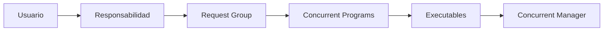
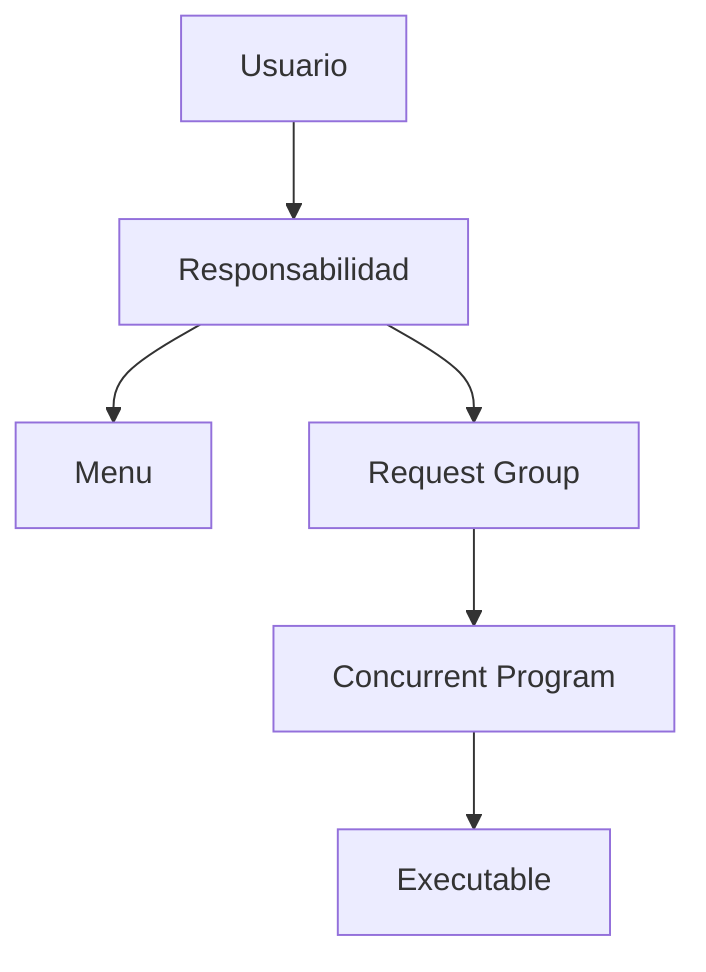
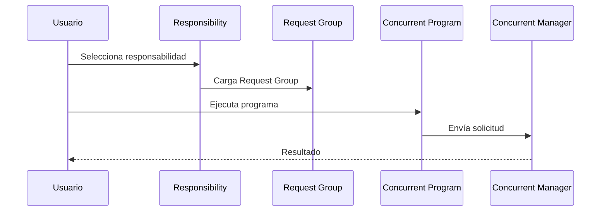

# Request Groups en Oracle E-Business Suite

> Guía para crear, administrar y utilizar Request Groups en Oracle E-Business Suite R12.2.

---

# Objetivo

Comprender el funcionamiento de los Request Groups y su relación con:

- Concurrent Programs.
- Responsabilidades.
- Seguridad de ejecución.
- Usuarios de Oracle EBS.

---

# ¿Qué es un Request Group?

Un **Request Group** es un conjunto de programas concurrentes e informes que pueden ser ejecutados desde una responsabilidad.

Define qué procesos están disponibles cuando un usuario selecciona:

```
View Requests

↓

Submit a New Request
```

---

# Arquitectura



---

# Relación entre componentes



---

# Componentes

## Responsibility

Define el acceso funcional del usuario.

Ejemplo:

```
XX Customer Super User
```

Contiene:

- Menu.
- Request Group.
- Profile Options.

---

## Request Group

Agrupa programas disponibles.

Ejemplo:

```
XXCUS Customer Reports
```

Incluye:

```
XX Customer Listing Report

XX Customer XML Report

XX Customer Interface
```

---

## Concurrent Program

Proceso ejecutable.

Ejemplo:

```
XXCUST_CUSTOMER_XML_TEST
```

---

# Crear un Request Group

Ruta:

```
System Administrator

↓

Security

↓

Responsibility

↓

Request
```

o:

```
Application Developer

↓

Request Group
```

---

# Definición

Ejemplo:

| Campo | Valor |
|-|-|
| Group | XXCUS_CUSTOMER_RG |
| Application | XXCUS |
| Description | Reportes personalizados de clientes |

---

# Agregar Concurrent Programs

Ejemplo:

| Type | Name |
|-|-|
| Program | XX Customer Report |
| Program | XX Customer XML |
| Program | XX Customer Interface |

---

# Asignar Request Group a una Responsibility

Ruta:

```
System Administrator

↓

Security

↓

Responsibility

↓

Define
```

Ejemplo:

| Campo | Valor |
|-|-|
| Responsibility | XX Customer Super User |
| Request Group | XXCUS_CUSTOMER_RG |

---

# Flujo de ejecución



---

# Consultas SQL

## Request Groups

```sql
SELECT
       request_group_name,
       description
FROM
       fnd_request_groups;
```

---

## Programas asociados a Request Group

```sql
SELECT
       frg.request_group_name,
       fcpt.user_concurrent_program_name
FROM
       fnd_request_groups frg,
       fnd_request_group_units frgu,
       fnd_concurrent_programs_tl fcpt
WHERE
       frg.request_group_id =
       frgu.request_group_id
AND
       frgu.request_unit_id =
       fcpt.concurrent_program_id;
```

---

## Responsabilidades y Request Groups

```sql
SELECT
       responsibility_name,
       request_group_id
FROM
       fnd_responsibility_vl;
```

---

# Ejemplo práctico

Crear un grupo para reportes de clientes.

## Request Group

```
XXCUS_CUSTOMER_REPORTS
```

Contiene:

```
XXCUST_CUSTOMER_XML_TEST
XXCUST_CUSTOMER_LIST
XXCUST_CUSTOMER_INTERFACE
```

Asignarlo a:

```
XX Customer Manager
```

Resultado:

El usuario podrá visualizar:

```
Submit Request

    Available Programs

        XX Customer XML Report

        XX Customer List

        XX Customer Interface
```

---

# Seguridad

Los Request Groups permiten controlar:

- Qué programas puede ejecutar un usuario.
- Qué reportes aparecen en una responsabilidad.
- Separación entre áreas funcionales.

Ejemplo:

```
AP Manager Responsibility

        |
        |
        +-- AP Invoice Import
        +-- AP Accounting Process


AR Manager Responsibility

        |
        |
        +-- AutoInvoice
        +-- Customer Reports
```

---

# Errores frecuentes

## Concurrent Program no aparece

Validar:

- Programa registrado.
- Programa habilitado.
- Request Group correcto.
- Responsibility correcta.

---

## Usuario puede ejecutar procesos incorrectos

Revisar:

- Request Group asignado.
- Menús.
- Responsabilidades.
- Seguridad de usuarios.

---

## Programa aparece pero falla

El Request Group solo controla disponibilidad.

Validar:

- Executable.
- Package PL/SQL.
- Parámetros.
- Value Sets.
- Concurrent Manager.

---

# Buenas prácticas

!!! tip "Recomendaciones"

    - Crear Request Groups personalizados con prefijo XX.
    - Separar grupos por funcionalidad.
    - No modificar grupos estándar de Oracle.
    - Documentar programas incluidos.
    - Mantener control de cambios en Git.
    - Revisar permisos antes de producción.

---

# Laboratorio

## Crear un Request Group personalizado

Objetivo:

Crear un grupo de reportes para clientes.

Actividades:

1. Crear Concurrent Programs.
2. Crear Request Group.
3. Agregar programas.
4. Asociarlo a una Responsibility.
5. Validar ejecución desde EBS.

---

# Referencias

- Oracle E-Business Suite System Administrator's Guide.
- Oracle Application Object Library Developer's Guide.