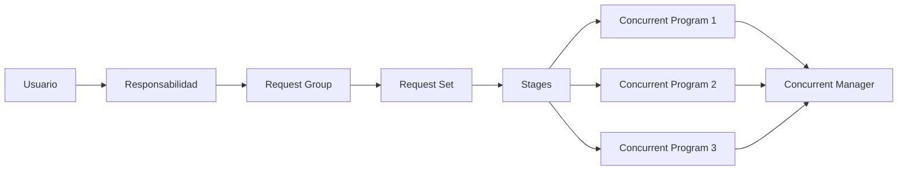
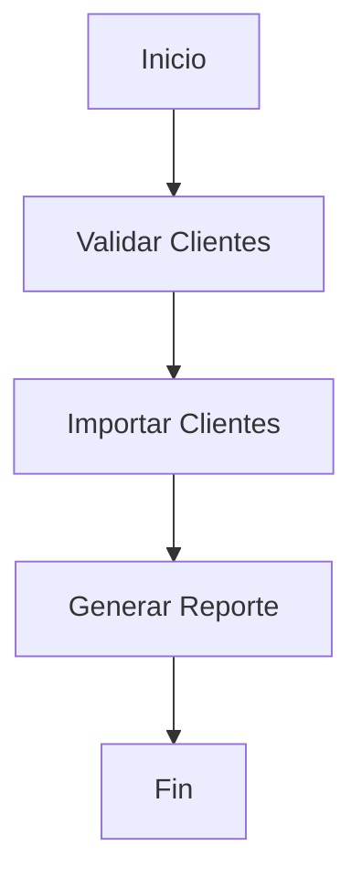

# Request Sets en Oracle E-Business Suite

> Guía para crear, administrar y ejecutar conjuntos de solicitudes (Request Sets) en Oracle E-Business Suite R12.2.

---

# Objetivo

Comprender el funcionamiento de los Request Sets y aprender a:

- Crear conjuntos de solicitudes.
- Definir etapas de ejecución.
- Ejecutar programas en secuencia.
- Ejecutar procesos en paralelo.
- Administrar dependencias entre programas.

---

# ¿Qué es un Request Set?

Un **Request Set** es un conjunto de Concurrent Programs agrupados para ejecutarse como un único proceso.

Permite automatizar procesos que requieren varios pasos.

Ejemplo:

```
Carga de clientes

    |
    |
    +-- Validar archivo

    |
    |
    +-- Importar clientes

    |
    |
    +-- Generar reporte
```

---

# Diferencia Request Group vs Request Set

| Concepto | Función |
|-|-|
| Request Group | Controla qué programas puede ejecutar una responsabilidad |
| Request Set | Define una secuencia de ejecución de programas |

---

# Arquitectura



---

# Componentes de un Request Set

Un Request Set está formado por:

```
Request Set

    |
    |
    +-- Stage

          |
          |
          +-- Concurrent Program

          |
          |
          +-- Parámetros
```

---

# Stages

Un **Stage** representa una etapa dentro del proceso.

Permite definir:

- Orden de ejecución.
- Dependencias.
- Paralelismo.

Ejemplo:

```
Stage 1

    |
    +-- Validación


Stage 2

    |
    +-- Importación


Stage 3

    |
    +-- Reporte
```

---

# Ejemplo de flujo



---

# Crear un Request Set

Ruta:

```
System Administrator

↓

Concurrent

↓

Request Set
```

---

# Definición

Ejemplo:

| Campo | Valor |
|-|-|
| Request Set | XXCUS_CUSTOMER_PROCESS |
| Application | XXCUS |
| Description | Proceso completo clientes |

---

# Agregar Stages

Ejemplo:

## Stage 1

Nombre:

```
VALIDATION
```

Programa:

```
XX Validate Customers
```

---

## Stage 2

Nombre:

```
IMPORT
```

Programa:

```
XX Import Customers
```

---

## Stage 3

Nombre:

```
REPORT
```

Programa:

```
XX Customer Report
```

---

# Ejecución en paralelo

Ejemplo:

```
Stage 1

     |
     |
     +----------------+
     |                |
     v                v

Reporte A        Reporte B

```

Útil cuando los procesos no dependen entre sí.

---

# Ejecución secuencial

Ejemplo:

```
Carga Archivo

       |

Validación

       |

Importación

       |

Reporte Final
```

---

# Parámetros

Los parámetros pueden propagarse entre programas.

Ejemplo:

```
P_ORG_ID

      |

      v

Programa 1

      |

      v

Programa 2
```

---

# Consultas SQL

## Request Sets

```sql
SELECT
       request_set_name,
       description
FROM
       fnd_request_sets;
```

---

## Programas dentro de un Request Set

```sql
SELECT
       frs.user_request_set_name,
       fcpt.user_concurrent_program_name
FROM
       fnd_request_sets frs,
       fnd_request_set_programs frsp,
       fnd_concurrent_programs_tl fcpt
WHERE
       frs.request_set_id =
       frsp.request_set_id
AND
       frsp.concurrent_program_id =
       fcpt.concurrent_program_id;
```

---

# Ejemplo práctico

## Proceso de clientes

Request Set:

```
XXCUS_CUSTOMER_LOAD
```

Flujo:

```
1. Validar archivo

        |

2. Cargar interfaz

        |

3. Ejecutar importación

        |

4. Generar reporte
```

---

# Uso con Interfaces

Los Request Sets son comunes en:

- Interfaces de clientes.
- Cargas masivas.
- Procesos contables.
- Integraciones externas.
- Cierres mensuales.

---

# Troubleshooting

## Un programa no ejecuta

Validar:

- Stage anterior completado.
- Condiciones de ejecución.
- Concurrent Manager activo.
- Parámetros enviados.

---

## Request Set queda Pending

Revisar:

- Programas incompatibles.
- Cola de Concurrent Manager.
- Estado de requests hijos.

---

## Programa hijo falla

Consultar:

```sql
SELECT
       request_id,
       phase_code,
       status_code
FROM
       fnd_concurrent_requests
WHERE
       parent_request_id = :REQUEST_ID;
```

---

# Buenas prácticas

!!! tip "Recomendaciones"

    - Crear Request Sets con prefijo XX.
    - Documentar cada Stage.
    - Evitar procesos demasiado grandes.
    - Separar validación e importación.
    - Registrar mensajes con FND_FILE.
    - Controlar errores antes de continuar al siguiente Stage.
    - Probar cada Concurrent Program individualmente.

---

# Laboratorio

## Crear un proceso completo de clientes

Objetivo:

Automatizar una carga de clientes.

Actividades:

1. Crear Concurrent Programs.
2. Crear Request Set.
3. Crear Stages.
4. Definir secuencia.
5. Ejecutar desde una Responsibility.
6. Validar logs.

---

# Referencias

- Oracle E-Business Suite System Administrator's Guide.
- Oracle Concurrent Processing Guide.
- Oracle Application Object Library Developer's Guide.