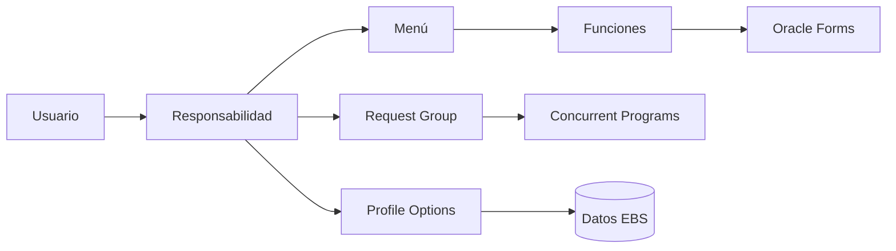
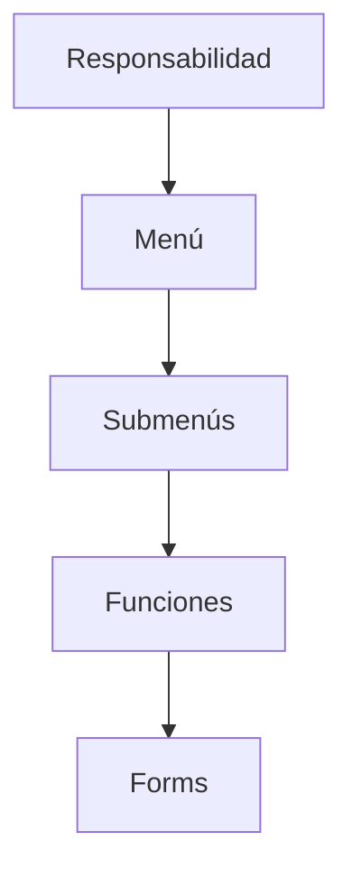
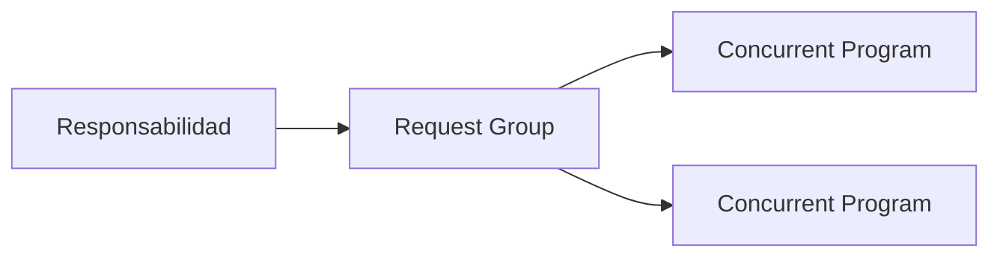

# Responsabilidades en Oracle E-Business Suite

> Guía para crear, administrar y entender las responsabilidades en Oracle E-Business Suite R12.2.

---

# Objetivo

Comprender el funcionamiento de las responsabilidades y aprender a:

- Crear responsabilidades personalizadas.
- Asignar menús.
- Asociar Request Groups.
- Controlar acceso mediante responsabilidades.
- Relacionarlas con usuarios y perfiles.

---

# ¿Qué es una Responsabilidad?

Una **Responsabilidad** es un nivel de seguridad dentro de Oracle EBS que define qué funcionalidades puede utilizar un usuario.

Una responsabilidad determina:

- Qué menú puede visualizar.
- Qué formularios puede abrir.
- Qué Concurrent Programs puede ejecutar.
- Qué datos puede consultar mediante perfiles.

---

# Arquitectura



---

# Componentes de una Responsabilidad

Una responsabilidad contiene:

| Componente | Descripción |
|------------|-------------|
| Nombre | Nombre visible para usuario |
| Application | Aplicación asociada |
| Responsibility Key | Código interno |
| Menu | Navegación disponible |
| Request Group | Programas ejecutables |
| Data Group | Conexión de aplicación |

---

# Ejemplo

Crear una responsabilidad para clientes:

```
Nombre:

XX Customer Manager


Application:

XXCUS


Responsibility Key:

XXCUS_CUSTOMER_MGR
```

---

# Crear una Responsabilidad

Ruta:

```
System Administrator

↓

Security

↓

Responsibility

↓

Define
```

---

# Campos principales

## Responsibility Name

Nombre mostrado al usuario.

Ejemplo:

```
XX Customer Manager
```

---

## Application

Aplicación propietaria.

Ejemplo:

```
XXCUS Custom Application
```

---

## Responsibility Key

Identificador único.

Ejemplo:

```
XXCUS_CUSTOMER_MGR
```

Buenas prácticas:

- Sin espacios.
- En mayúsculas.
- Prefijo XX.

---

## Menu

Define las opciones disponibles.

Ejemplo:

```
XXCUS_CUSTOMER_MENU
```

---

## Request Group

Define los Concurrent Programs disponibles.

Ejemplo:

```
XXCUS_CUSTOMER_REPORTS
```

---

# Relación con Menús



---

# Relación con Request Groups



---

# Asignar una Responsabilidad a un Usuario

Ruta:

```
System Administrator

↓

Security

↓

User

↓

Define
```

Ejemplo:

Usuario:

```
OPERADOR1
```

Asignar:

```
XX Customer Manager
```

---

# Consultas SQL

## Consultar responsabilidades

```sql
SELECT
       responsibility_name,
       responsibility_key,
       application_id
FROM
       fnd_responsibility_vl;
```

---

## Responsabilidades de un usuario

```sql
SELECT
       fu.user_name,
       fr.responsibility_name
FROM
       fnd_user fu,
       fnd_user_resp_groups_direct furg,
       fnd_responsibility_vl fr
WHERE
       fu.user_id = furg.user_id
AND
       furg.responsibility_id = fr.responsibility_id;
```

---

## Consultar menú asociado

```sql
SELECT
       responsibility_name,
       menu_id
FROM
       fnd_responsibility_vl;
```

---

# APIs relacionadas

## Inicializar contexto

Cuando se ejecutan APIs fuera de Oracle EBS:

```plsql
BEGIN

FND_GLOBAL.APPS_INITIALIZE
(
    user_id      => 1234,
    resp_id      => 56789,
    resp_appl_id => 200
);

END;
/
```

---

# Multi-Org y Responsabilidades

Las responsabilidades normalmente trabajan junto con:

- MO: Operating Unit
- MO: Security Profile
- HR Security Profile

Ejemplo:

```
Responsabilidad

       |

       v

MO: Operating Unit

       |

       v

Datos permitidos
```

---

# Seguridad

Una responsabilidad permite controlar:

- Acceso funcional.
- Procesos disponibles.
- Menús.
- Datos visibles.

Ejemplo:

```
AP Manager

    |
    +-- Facturas AP
    +-- Pagos
    +-- Reportes AP


AR Manager

    |
    +-- Clientes
    +-- Facturación
    +-- Cobranza
```

---

# Migración con FNDLOAD

Las responsabilidades pueden transportarse mediante archivos LDT.

Ejemplo:

Exportar:

```bash
FNDLOAD apps/password \
0 Y DOWNLOAD \
$FND_TOP/patch/115/import/afscursp.lct \
XXCUS_RESP.ldt \
FND_RESPONSIBILITY \
RESP_KEY=XXCUS_CUSTOMER_MGR
```

---

# Errores frecuentes

## La responsabilidad no aparece al iniciar sesión

Validar:

- Usuario asignado.
- Fecha de vigencia.
- Responsabilidad habilitada.
- Application correcta.

---

## No aparecen programas concurrentes

Validar:

- Request Group asociado.
- Concurrent Program incluido.
- Programa habilitado.

---

## No aparece un formulario

Validar:

- Menú.
- Función.
- Responsabilidad.
- Grant de seguridad.

---

# Buenas prácticas

!!! tip "Recomendaciones"

    - Crear responsabilidades personalizadas con prefijo XX.
    - No modificar responsabilidades estándar Oracle.
    - Mantener separación por función de negocio.
    - Documentar menú y Request Group asociados.
    - Usar FNDLOAD para migraciones.
    - Validar seguridad antes de producción.

---

# Laboratorio

## Crear una responsabilidad personalizada

Objetivo:

Crear acceso para reportes de clientes.

Actividades:

1. Crear aplicación personalizada.
2. Crear menú.
3. Crear Request Group.
4. Crear responsabilidad.
5. Asignar usuario.
6. Validar acceso.

---

# Referencias

- Oracle E-Business Suite System Administrator's Guide.
- Oracle Application Object Library Developer's Guide.