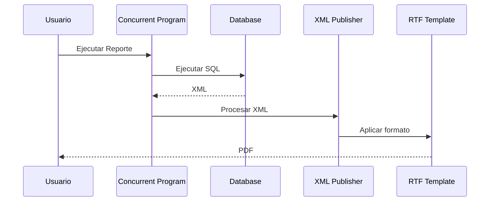
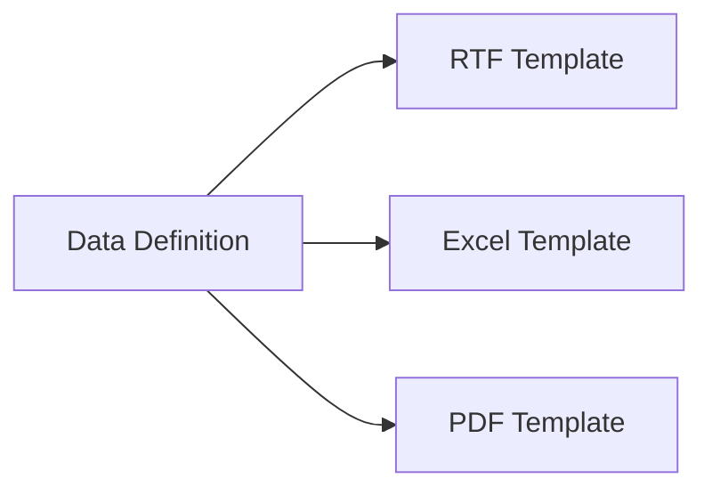

# RTF Templates en Oracle E-Business Suite

> Guía para crear, diseñar y utilizar plantillas RTF en Oracle XML Publisher / BI Publisher dentro de Oracle E-Business Suite R12.2.

---

# Objetivo

Aprender a desarrollar plantillas RTF para:

- Presentar datos XML en formatos legibles.
- Crear reportes PDF.
- Diseñar encabezados y detalles.
- Utilizar campos XML.
- Aplicar tablas, condiciones y formatos.
- Integrar Templates con Data Definitions.

---

# ¿Qué es un RTF Template?

Un **RTF Template** es un archivo creado con Microsoft Word que contiene:

- Diseño visual del reporte.
- Campos XML.
- Reglas de presentación.
- Formato de salida.

XML Publisher utiliza el archivo RTF junto con el XML generado por el Data Template para producir el documento final.

---

# Arquitectura XML Publisher


---

# Flujo de generación



---

# Componentes de un Reporte XML Publisher

```text
Concurrent Program

        |

        v

Data Definition

        |

        v

Data Template

        |

        v

XML

        |

        v

RTF Template

        |

        v

PDF
```

---

# Crear un RTF Template

## Requisitos

Instalar:

- Microsoft Word.
- Oracle BI Publisher Desktop Plugin.

---

# BI Publisher Desktop

Permite:

- Insertar campos XML.
- Crear tablas dinámicas.
- Probar plantillas.
- Visualizar datos.

---

# Ejemplo XML

Data generado:

```xml
<DATA_DS>

<G_CUSTOMERS>

<PARTY_ID>1001</PARTY_ID>

<PARTY_NAME>
ACME CORPORATION
</PARTY_NAME>

<STATUS>
ACTIVE
</STATUS>

</G_CUSTOMERS>

</DATA_DS>
```

---

# Insertar campos XML

En Word:

```
Insert

↓

Field

↓

BI Publisher

↓

Field
```

Campos:

```
<?PARTY_ID?>

<?PARTY_NAME?>

<?STATUS?>
```

---

# Ejemplo de diseño

Tabla:

| Customer ID | Customer Name | Status |
|-|-|-|
| <?PARTY_ID?> | <?PARTY_NAME?> | <?STATUS?> |

---

# Grupos XML

Cuando existen múltiples registros se utiliza:

```
for-each
```

Ejemplo:

```xml
<?for-each:G_CUSTOMERS?>

<?PARTY_ID?>

<?PARTY_NAME?>

<?STATUS?>

<?end for-each?>
```

---

# Tablas dinámicas

Ejemplo:

```text
Customer Report


Customer ID        Customer Name

<?for-each:G_CUSTOMERS?>

<?PARTY_ID?>

<?PARTY_NAME?>

<?end for-each?>
```

---

# Condiciones

Permiten mostrar información dependiendo de valores XML.

Ejemplo:

```xml
<?if:STATUS='ACTIVE'?>

Cliente Activo

<?end if?>
```

---

# Formato de fechas

Ejemplo:

```xml
<?format-date(CREATED_DATE,'DD-MM-YYYY')?>
```

---

# Formato de números

Ejemplo:

```xml
<?format-number(AMOUNT,'999,999.99')?>
```

---

# Subtotales

Ejemplo:

```xml
<?sum(AMOUNT)?>
```

---

# Registro en Oracle EBS

Ruta:

```
XML Publisher Administrator

↓

Templates
```

---

# Definición del Template

Ejemplo:

| Campo | Valor |
|-|-|
| Application | XXCUS |
| Template Name | XX Customer Report |
| Data Definition | XXCUST_CUSTOMER_RPT |
| Type | RTF |
| Language | Spanish |

---

# Asociación Data Definition - Template



---

# Ejemplo práctico

Reporte:

```
XXCUST_CUSTOMER_XML_TEST
```

Componentes:

```
Package PL/SQL

        |

        v

XML

        |

        v

Data Definition

        |

        v

RTF Template

        |

        v

PDF
```

---

# Errores frecuentes

## Reporte vacío

Causas:

- Campos XML incorrectos.
- Grupo XML incorrecto.
- Falta de `for-each`.
- Data Template sin datos.

---

## El XML tiene datos pero PDF vacío

Validar:

- Nombre de grupos.
- Campos XML.
- Asociación Template/Data Definition.

---

## Error:

```
Specification mandates value for attribute
```

Causa:

XML mal formado.

Revisar:

- Caracteres especiales.
- Etiquetas XML.
- Datos sin escapar.

---

## Caracteres extraños

Causa:

Codificación.

Validar:

- UTF-8.
- Caracteres especiales.
- Conversión XML.

---

# Buenas prácticas

!!! tip "Recomendaciones"

    - Mantener nombres de campos XML claros.
    - Diseñar primero el XML antes del RTF.
    - Evitar lógica compleja dentro del Template.
    - Mantener versiones del RTF en Git.
    - Probar con datos reales.
    - Documentar grupos y campos utilizados.

---

# Laboratorio

## Crear reporte de clientes

Objetivo:

Generar un PDF con clientes Oracle EBS.

Actividades:

1. Crear Data Template.
2. Generar XML.
3. Crear RTF Template.
4. Insertar campos XML.
5. Asociar Template.
6. Ejecutar Concurrent Program.
7. Validar PDF generado.

---

# Referencias

- Oracle XML Publisher Report Designer's Guide.
- Oracle BI Publisher User Guide.
- Oracle E-Business Suite Developer's Guide.