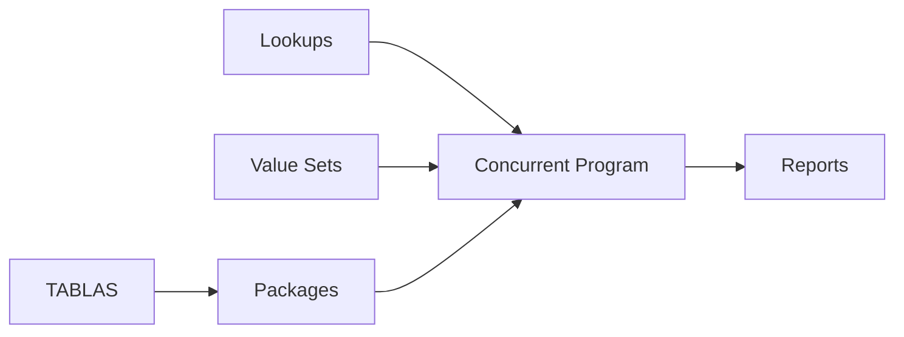

# SQL Scripts en Oracle E-Business Suite

> Guía de desarrollo, organización, ejecución y migración de scripts SQL utilizados en Oracle E-Business Suite R12.2.

---

# Objetivo

Definir estándares para crear scripts SQL utilizados en:

- Instalaciones de desarrollos.
- Migraciones entre ambientes.
- Correcciones de datos.
- Creación de objetos personalizados.
- Validaciones técnicas.
- Soporte L3.

---

# Tipos de Scripts

En Oracle EBS normalmente se manejan:

| Tipo | Extensión | Uso |
|-|-|-|
| SQL | `.sql` | DDL, DML, consultas |
| PL/SQL | `.pls` | Packages, procedimientos |
| Shell | `.sh` | Automatización |
| Loader | `.ldt` | Migración FNDLOAD |
| Control File | `.ctl` | SQL*Loader |

---

# Estructura recomendada

Ejemplo:

```
XXCUS_CUSTOMER/
|
├── install/
│
├── sql/
│   ├── xx_customer_tables.sql
│   ├── xx_customer_indexes.sql
│   └── xx_customer_grants.sql
│
├── plsql/
│   ├── xx_customer_pkg.pks
│   └── xx_customer_pkg.pkb
│
├── seed/
│   └── xx_lookup_values.sql
│
└── README.md
```

---

# Encabezado estándar

Todo script debe contener información del desarrollo.

Ejemplo:

```sql
/*
=====================================================
Script      : xx_customer_tables.sql
Autor       : XXCUS
Fecha       : 2026-07-27
Descripción : Creación tabla clientes
Módulo      : AR
Versión     : 1.0
=====================================================
*/
```

---

# Variables de entorno

Antes de ejecutar:

```bash
echo $ORACLE_SID

echo $ORACLE_HOME

echo $APPL_TOP
```

---

# Conexión Oracle EBS

Ejemplo:

```bash
sqlplus apps/password@EBSCDB
```

---

# Scripts DDL

## Crear tabla personalizada

Ejemplo:

```sql
CREATE TABLE xx_customer_status
(
    customer_id NUMBER,
    status_code VARCHAR2(30),
    created_by NUMBER,
    creation_date DATE
);
```

---

# Crear índice

```sql
CREATE INDEX xx_customer_status_n1
ON xx_customer_status(customer_id);
```

---

# Crear secuencia

```sql
CREATE SEQUENCE xx_customer_status_seq
START WITH 1
INCREMENT BY 1;
```

---

# Grants

Ejemplo:

```sql
GRANT SELECT, INSERT, UPDATE
ON xx_customer_status
TO APPS;
```

---

# Sinónimos

Ejemplo:

```sql
CREATE OR REPLACE SYNONYM apps.xx_customer_status
FOR xxcus.xx_customer_status;
```

---

# Scripts DML

## Insertar datos iniciales

Ejemplo:

```sql
INSERT INTO xx_customer_status
(
 customer_id,
 status_code
)
VALUES
(
 1001,
 'ACTIVE'
);

COMMIT;
```

---

# Actualización de datos

Siempre validar antes:

```sql
SELECT *
FROM xx_customer_status
WHERE status_code='OLD';
```

Luego:

```sql
UPDATE xx_customer_status
SET status_code='ACTIVE'
WHERE status_code='OLD';

COMMIT;
```

---

# Bloques PL/SQL

Ejemplo:

```sql
BEGIN

    UPDATE xx_customer_status
    SET status_code='ACTIVE';

    COMMIT;

END;
/
```

---

# Validaciones antes de ejecutar

Ejemplo:

```sql
SELECT COUNT(*)
FROM xx_customer_status;
```

---

# Manejo de errores

Ejemplo:

```sql
BEGIN

    INSERT INTO xx_table
    VALUES
    (
       1
    );

EXCEPTION

WHEN OTHERS THEN

    ROLLBACK;

    RAISE;

END;
/
```

---

# Scripts para Oracle EBS

Los desarrollos normalmente incluyen:

```
1. Tablas

2. Índices

3. Secuencias

4. Packages

5. Grants

6. Sinónimos

7. Lookups

8. Value Sets

9. Concurrent Programs

10. Request Groups
```

---

# Ejemplo estructura EBS



---

# Uso de FND_GLOBAL

En scripts que simulan ejecución EBS:

```sql
BEGIN

FND_GLOBAL.APPS_INITIALIZE
(
    user_id      => 1234,
    resp_id      => 56789,
    resp_appl_id => 200
);

END;
/
```

---

# Uso de FND_FILE

Para Concurrent Programs:

```plsql
FND_FILE.PUT_LINE
(
    FND_FILE.LOG,
    'Proceso iniciado'
);
```

---

# Ejecución de Scripts

## SQLPlus

```bash
sqlplus apps/password <<EOF

@xx_customer_tables.sql

EOF
```

---

## SQL Developer

Ejecutar:

```
Run Script (F5)
```

No utilizar:

```
Run Statement (Ctrl+Enter)
```

para instalaciones completas.

---

# Migración entre ambientes

Flujo recomendado:


---

# Versionamiento

Ejemplo:

```
scripts/

V1.0

xx_customer_tables.sql


V1.1

xx_customer_indexes.sql
```

---

# Buenas prácticas

!!! tip "Recomendaciones"

    - Nunca ejecutar scripts directamente en producción sin validación.
    - Usar prefijo XX para objetos personalizados.
    - Agregar COMMIT explícito.
    - Usar ROLLBACK en errores.
    - Documentar cambios.
    - Versionar en Git.
    - Crear scripts reversibles cuando sea posible.

---

# Checklist de instalación

Antes de liberar:

- [ ] Validar conexión APPS.
- [ ] Revisar permisos.
- [ ] Ejecutar en ambiente limpio.
- [ ] Validar objetos creados.
- [ ] Revisar logs.
- [ ] Documentar versión.
- [ ] Registrar cambios en Git.

---

# Laboratorio

## Crear instalación de un desarrollo EBS

Objetivo:

Crear un paquete completo de instalación.

Actividades:

1. Crear tabla personalizada.
2. Crear package PL/SQL.
3. Crear lookup.
4. Crear value set.
5. Registrar concurrent program.
6. Crear script de instalación.
7. Ejecutar en ambiente QA.

---

# Referencias

- Oracle Database SQL Language Reference.
- Oracle E-Business Suite Developer's Guide.
- Oracle Application Object Library Developer's Guide.