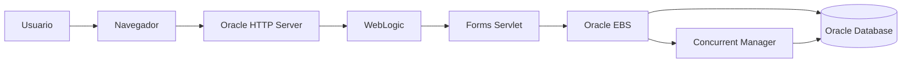

# Troubleshooting Oracle E-Business Suite R12.2

> Guía de diagnóstico y solución de problemas comunes en Oracle E-Business Suite R12.2.

---

# Objetivo

Proporcionar procedimientos para diagnosticar problemas relacionados con:

- Oracle Database.
- Concurrent Manager.
- Oracle Forms.
- Oracle Reports.
- BI Publisher.
- WebLogic.
- Oracle HTTP Server.
- Interfaces.
- Performance.
- Sesiones bloqueadas.

---

# Arquitectura de diagnóstico



---

# Metodología de Troubleshooting

Siempre validar en este orden:

```text
1. Usuario / Responsabilidad

        |

2. Aplicación EBS

        |

3. Servicios Middleware

        |

4. Base de Datos

        |

5. Sistema Operativo
```

---

# Información inicial requerida

Antes de analizar un problema obtener:

## Usuario

```text
Usuario EBS:

Responsabilidad:

Fecha/Hora:

Programa ejecutado:

Request ID:

Mensaje mostrado:
```

---

# Validar servicios EBS

## Estado de servicios

Servidor Apps:

```bash
$ADMIN_SCRIPTS_HOME/adstrall.sh
```

o:

```bash
$ADMIN_SCRIPTS_HOME/adadminsrvctl.sh status
```

---

# WebLogic

Validar:

```bash
$DOMAIN_HOME/bin/status.sh
```

Procesos:

```bash
ps -ef | grep weblogic
```

---

# Oracle HTTP Server

Validar:

```bash
ps -ef | grep httpd
```

Logs:

```bash
$INST_TOP/logs/ora/10.1.3/Apache
```

---

# Concurrent Manager

## Ver procesos activos

```bash
ps -ef | grep FNDLIBR
```

---

## Validar Concurrent Managers

SQL:

```sql
SELECT
       concurrent_queue_name,
       running_processes,
       max_processes
FROM
       fnd_concurrent_queues;
```

---

# Concurrent Request Troubleshooting

## Consultar estado de request

```sql
SELECT
       request_id,
       phase_code,
       status_code,
       actual_start_date,
       actual_completion_date
FROM
       fnd_concurrent_requests
WHERE
       request_id = 123456;
```

---

# Estados comunes

| Phase | Status | Descripción |
|-|-|-|
| Pending | Normal | Esperando ejecución |
| Running | Normal | Ejecutando |
| Completed | Normal | Finalizado |
| Error | Problema | Revisar log |
| Cancelled | Usuario | Cancelado |

---

# Obtener Log de Concurrent Request

Ubicación:

```bash
$APPLCSF/$APPLLOG
```

Ejemplo:

```bash
ls -ltr $APPLCSF/$APPLLOG
```

---

# Error APP-FND

Ejemplo:

```
APP-FND-01564
```

Validar:

- Log del Concurrent Request.
- Package PL/SQL.
- Grants.
- Sinónimos.

---

# Oracle Forms

## FRM-40735

Error:

```
FRM-40735: ON-ERROR trigger raised unhandled exception
```

Validar:

- Trigger Forms.
- Código PL/SQL.
- Package inválido.

Consultar:

```sql
SELECT
object_name,
status
FROM
user_objects
WHERE
status='INVALID';
```

---

# FRM-92101

Error:

```
FRM-92101: There was a failure in the Forms Server
```

Validar:

WebLogic:

```bash
ps -ef | grep forms
```

Logs:

```bash
$DOMAIN_HOME/servers/WLS_FORMS/logs
```

---

# Invalid Objects

## Buscar objetos inválidos

```sql
SELECT
owner,
object_name,
object_type
FROM
dba_objects
WHERE
status='INVALID';
```

---

## Recompilar objetos

```sql
EXEC UTL_RECOMP.RECOMP_SERIAL();
```

---

# Problemas de conexión

## ORA-12154

```
TNS:could not resolve the connect identifier
```

Validar:

```bash
cat $TNS_ADMIN/tnsnames.ora
```

Probar:

```bash
tnsping SERVICIO
```

---

## ORA-12514

```
listener does not currently know of service requested
```

Validar:

```bash
lsnrctl status
```

---

# Sesiones bloqueadas

## Buscar bloqueos

```sql
SELECT
blocking_session,
sid,
serial#,
username,
event
FROM
v$session
WHERE
blocking_session IS NOT NULL;
```

---

## Terminar sesión

```sql
ALTER SYSTEM KILL SESSION
'123,456'
IMMEDIATE;
```

---

# Performance SQL

## SQL activos

```sql
SELECT
sql_id,
elapsed_time,
executions,
sql_text
FROM
v$sql
ORDER BY
elapsed_time DESC;
```

---

# BI Publisher Troubleshooting

## XML vacío

Validar:

- Data Template.
- SQL Query.
- Parámetros.
- Bind Variables.

---

## RTF genera PDF vacío

Validar:

- Nombres XML.
- Grupos `for-each`.
- Asociación Template/Data Definition.

---

# XML Publisher Logs

Buscar:

```bash
grep -i error *.log
```

Errores comunes:

```
XDOException
```

```
Java InvocationTargetException
```

---

# Data Fix Troubleshooting

Antes de modificar datos:

Ejecutar:

```sql
SELECT *
FROM tabla
WHERE condicion;
```

Crear respaldo:

```sql
CREATE TABLE xx_backup AS
SELECT *
FROM tabla
WHERE condicion;
```

Ejecutar cambio:

```sql
UPDATE tabla
SET campo='VALOR'
WHERE condicion;

COMMIT;
```

---

# Errores comunes Oracle EBS

| Error | Causa común |
|-|-|
| ORA-01403 | No data found |
| ORA-00904 | Columna inválida |
| ORA-12899 | Valor excede tamaño |
| ORA-01031 | Permisos insuficientes |
| ORA-24247 | ACL Network |
| FRM-40735 | Error Forms |
| XDOException | XML Publisher |

---

# Comandos Linux útiles

## Procesos Oracle

```bash
ps -ef | grep oracle
```

---

## Espacio disco

```bash
df -h
```

---

## Memoria

```bash
free -m
```

---

## Logs recientes

```bash
find $INST_TOP/logs -mtime -1
```

---

# Checklist de soporte L3

Antes de cerrar incidente:

- [ ] Identificar usuario afectado.
- [ ] Obtener Request ID.
- [ ] Revisar logs.
- [ ] Validar servicios.
- [ ] Confirmar solución.
- [ ] Documentar causa raíz.
- [ ] Registrar cambio.

---

# Laboratorios

## Diagnóstico de Concurrent Request

Objetivo:

Encontrar causa de un proceso fallido.

Actividades:

1. Obtener Request ID.
2. Consultar FND_CONCURRENT_REQUESTS.
3. Revisar log.
4. Identificar error.
5. Aplicar solución.

---

# Referencias

- Oracle E-Business Suite Maintenance Guide.
- Oracle Application Object Library Developer's Guide.
- Oracle Concurrent Processing Guide.