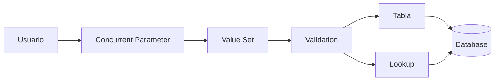
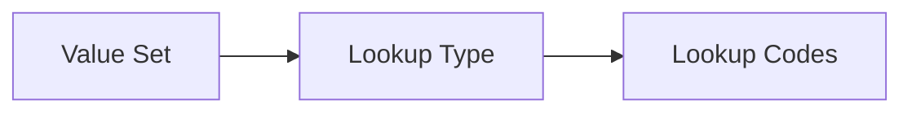
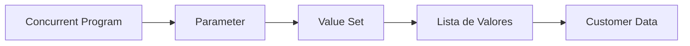

# Value Sets en Oracle E-Business Suite

> Guía para crear, configurar y utilizar Value Sets en Oracle E-Business Suite R12.2.

---

# Objetivo

Comprender el funcionamiento de los Value Sets y aprender a:

- Crear Value Sets personalizados.
- Utilizar validaciones.
- Asociarlos a parámetros de Concurrent Programs.
- Crear listas de valores (LOV).
- Usarlos en Flexfields.
- Consultarlos desde SQL.

---

# ¿Qué es un Value Set?

Un **Value Set** es una definición que controla los valores permitidos para un campo o parámetro dentro de Oracle EBS.

Permite definir:

- Tipo de dato.
- Longitud.
- Validaciones.
- Lista de valores.
- Reglas de selección.

---

# Ejemplos de uso

Los Value Sets se utilizan en:

- Parámetros de Concurrent Programs.
- Key Flexfields.
- Descriptive Flexfields.
- Reportes.
- Interfaces.
- Personalizaciones.

---

# Arquitectura



---

# Tipos de Value Sets

Oracle EBS soporta diferentes tipos:

| Tipo | Descripción |
|-|-|
| None | Sin validación |
| Independent | Valores definidos manualmente |
| Dependent | Depende de otro Value Set |
| Table | Valores provenientes de una tabla |
| Special | Validación especial |
| Pair | Rangos o pares de valores |

---

# Comparación de tipos

| Tipo | Uso |
|-|-|
| Independent | Estados, categorías, códigos fijos |
| Dependent | País → Estado → Ciudad |
| Table | Clientes, empleados, organizaciones |
| None | Texto libre |

---

# Crear un Value Set

Ruta:

```
Application Developer

↓

Flexfield

↓

Validation

↓

Sets
```

---

# Ejemplo Value Set Independent

Nombre:

```
XXCUS_STATUS_VS
```

Formato:

```
Char
```

Longitud:

```
20
```

Validación:

```
Independent
```

---

# Definir valores

Lookup:

```
ACTIVE
INACTIVE
BLOCKED
```

Resultado:

| Código | Meaning |
|-|-|
| ACTIVE | Activo |
| INACTIVE | Inactivo |
| BLOCKED | Bloqueado |

---

# Value Set basado en Lookup

Ejemplo:

Lookup:

```
XXCUS_CUSTOMER_STATUS
```

Value Set:

```
XXCUS_CUSTOMER_STATUS_VS
```

Relación:



---

# Value Set Table

Permite obtener valores desde una tabla.

Ejemplo:

Mostrar clientes:

Tabla:

```sql
HZ_PARTIES
```

Query:

```sql
SELECT
       party_name,
       party_id
FROM
       hz_parties
ORDER BY
       party_name
```

---

# Estructura Table Value Set

Campos:

| Campo | Uso |
|-|-|
| ID Column | Valor interno |
| Value Column | Valor mostrado |
| WHERE Clause | Filtro |
| ORDER BY | Orden |

---

# Ejemplo Table Value Set

Nombre:

```
XXCUS_CUSTOMERS_VS
```

Validation:

```
Table
```

Tabla:

```
HZ_PARTIES
```

ID:

```
PARTY_ID
```

Value:

```
PARTY_NAME
```

---

# Uso en Concurrent Programs

Un parámetro utiliza un Value Set.

Ejemplo:

Concurrent Program:

```
XX Customer Report
```

Parámetro:

```
P_CUSTOMER
```

Value Set:

```
XXCUS_CUSTOMERS_VS
```

Flujo:



---

# Crear parámetro con Value Set

Ruta:

```
System Administrator

↓

Concurrent

↓

Program

↓

Parameters
```

Ejemplo:

| Campo | Valor |
|-|-|
| Parameter | Customer |
| Value Set | XXCUS_CUSTOMERS_VS |
| Required | Yes |

---

# Consultas SQL

## Consultar Value Sets

```sql
SELECT
       flex_value_set_name,
       description,
       validation_type
FROM
       fnd_flex_value_sets;
```

---

# Consultar valores de un Value Set

```sql
SELECT
       flex_value,
       enabled_flag,
       description
FROM
       fnd_flex_values_vl
WHERE
       flex_value_set_id =
       12345;
```

---

# Buscar Value Sets personalizados

```sql
SELECT
       flex_value_set_name
FROM
       fnd_flex_value_sets
WHERE
       flex_value_set_name LIKE 'XX%';
```

---

# Value Sets Dependientes

Ejemplo:

País:

```
XX_COUNTRY_VS
```

Estado:

```
XX_STATE_VS
```

Relación:

```text
México

   |
   +-- Guanajuato
   +-- Jalisco
   +-- Nuevo León
```

---

# Validación PL/SQL

Ejemplo:

```plsql
DECLARE

l_exists NUMBER;

BEGIN

SELECT COUNT(*)
INTO l_exists
FROM fnd_flex_values_vl
WHERE flex_value='ACTIVE';

END;
/
```

---

# Errores comunes

## LOV vacío

Validar:

- Query del Table Value Set.
- Grants.
- Sinónimos.
- WHERE clause.

---

## ORA-00942

```
table or view does not exist
```

Causa:

Falta acceso desde APPS.

Solución:

```sql
GRANT SELECT
ON tabla
TO apps;
```

---

## ORA-00904

```
invalid identifier
```

Causa:

Nombre de columna incorrecto.

Validar:

```sql
DESC tabla;
```

---

# Buenas prácticas

!!! tip "Recomendaciones"

    - Usar prefijo XX para desarrollos personalizados.
    - Evitar valores duplicados.
    - Documentar la fuente de datos.
    - Usar Lookup cuando aplique.
    - Validar permisos en Table Value Sets.
    - No utilizar SELECT *.
    - Probar LOV antes de producción.

---

# Laboratorio

## Crear Value Set de clientes

Objetivo:

Crear un parámetro que permita seleccionar clientes.

Actividades:

1. Crear Table Value Set.
2. Utilizar HZ_PARTIES.
3. Crear parámetro Concurrent Program.
4. Ejecutar reporte.
5. Validar LOV.

---

# Referencias

- Oracle E-Business Suite Flexfields Guide.
- Oracle Application Object Library Developer's Guide.