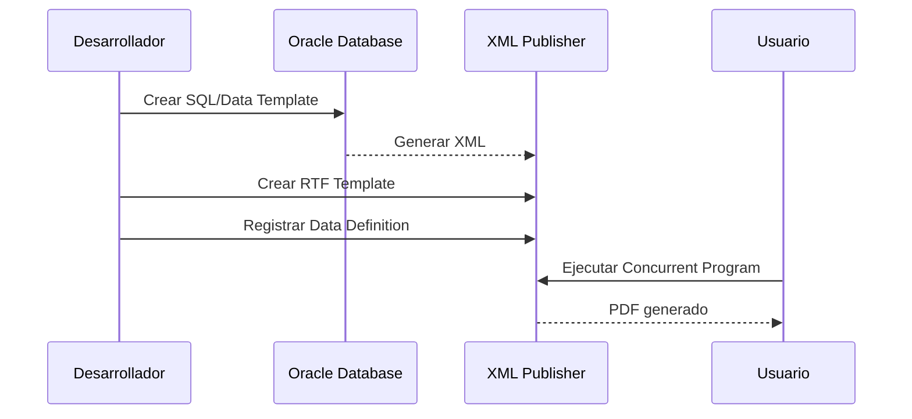
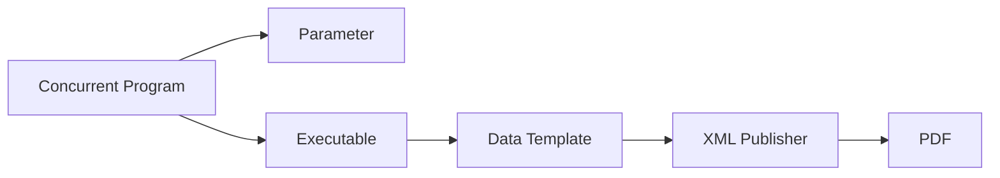

# Oracle XML Publisher / BI Publisher en Oracle E-Business Suite

> Guía completa para desarrollar, configurar y ejecutar reportes XML Publisher (BI Publisher) en Oracle E-Business Suite R12.2.

---

# Objetivo

Aprender el ciclo completo de desarrollo de reportes XML Publisher:

- Crear Data Templates.
- Generar XML.
- Crear Data Definitions.
- Diseñar RTF Templates.
- Registrar Templates.
- Configurar Concurrent Programs.
- Generar salidas PDF, Excel y HTML.

---

# ¿Qué es XML Publisher?

Oracle XML Publisher (actualmente BI Publisher) es la herramienta de reporting utilizada en Oracle EBS para generar documentos basados en:

- Datos XML.
- Plantillas de presentación.
- Reglas de formato.

Permite separar:

```
Datos

+

Diseño

=

Reporte final
```

---

# Arquitectura XML Publisher


---

# Componentes principales

## Data Template

Define:

- Consulta SQL.
- Parámetros.
- Estructura XML.
- Grupos de datos.

Ejemplo:

```
XXCUS_CUSTOMER_XML.xml
```

---

## XML Data

Archivo generado por el Data Engine.

Ejemplo:

```xml
<DATA_DS>

<G_CUSTOMERS>

<PARTY_ID>1001</PARTY_ID>

<PARTY_NAME>
ACME CORPORATION
</PARTY_NAME>

<STATUS>
ACTIVE
</STATUS>

</G_CUSTOMERS>

</DATA_DS>
```

---

## Data Definition

Relaciona:

```
XML Data

       +

Template
```

Ejemplo:

```
Application:

XXCUS


Code:

XXCUS_CUSTOMER_RPT
```

---

## RTF Template

Archivo Word utilizado para definir:

- Diseño.
- Tablas.
- Campos XML.
- Formatos.
- Condiciones.

Ejemplo:

```
XXCUS_CUSTOMER_RPT.rtf
```

---

# Flujo completo de desarrollo



---

# Crear Data Template

Ejemplo:

Archivo:

```
XXCUS_CUSTOMER.xml
```

Estructura:

```xml
<dataTemplate
name="XXCUS_CUSTOMER"
version="1.0">

<parameters>
<parameter name="P_STATUS"/>
</parameters>


<dataQuery>

<sqlStatement name="Q_CUSTOMERS">

<![CDATA[

SELECT
party_id,
party_name,
status

FROM
hz_parties

WHERE status = :P_STATUS

]]>

</sqlStatement>

</dataQuery>


<dataStructure>

<group
name="G_CUSTOMERS"
source="Q_CUSTOMERS">

<element
name="PARTY_ID"
value="PARTY_ID"/>

<element
name="PARTY_NAME"
value="PARTY_NAME"/>

<element
name="STATUS"
value="STATUS"/>

</group>

</dataStructure>


</dataTemplate>
```

---

# Generación de XML

El Data Engine genera:

```text
Data Template

        |

        v

XML

        |

        v

ROWSET
```

Ejemplo:

```xml
<G_CUSTOMERS>

<PARTY_ID>1001</PARTY_ID>

<PARTY_NAME>ACME</PARTY_NAME>

</G_CUSTOMERS>
```

---

# Data Definition

Ruta:

```
XML Publisher Administrator

        |

        v

Data Definitions
```

Ejemplo:

| Campo | Valor |
|-|-|
| Application | XXCUS |
| Code | XXCUS_CUSTOMER_RPT |
| Name | Customer Report |

---

# Template Registration

Ruta:

```
XML Publisher Administrator

        |

        v

Templates
```

Ejemplo:

| Campo | Valor |
|-|-|
| Template | XX Customer Report |
| Type | RTF |
| Language | Spanish |
| Data Definition | XXCUS_CUSTOMER_RPT |

---

# RTF Template

Ejemplo:

XML:

```xml
<G_CUSTOMERS>

<PARTY_NAME>

</G_CUSTOMERS>
```

RTF:

```
Customer:

<?PARTY_NAME?>
```

---

# Grupos XML

Para múltiples registros:

```xml
<?for-each:G_CUSTOMERS?>

<?PARTY_ID?>

<?PARTY_NAME?>

<?end for-each?>
```

---

# Concurrent Program

Flujo:



---

# Ejecutable XML Publisher

Ejemplo:

```
Executable Name:

XXCUS_CUSTOMER_XML


Execution Method:

Java Concurrent Program
```

---

# Parámetros comunes

Ejemplo:

```
P_STATUS
```

Value Set:

```
XX_STATUS_VS
```

---

# Diagnóstico

## Validar XML generado

Revisar:

```
View Output

View Log
```

---

## XML vacío

Validar:

```sql
SELECT COUNT(*)
FROM hz_parties;
```

Revisar:

- Parámetros.
- Bind variables.
- Query.
- Data Structure.

---

## PDF vacío

Validar:

- Campos XML.
- Nombre de grupos.
- For-each.
- Template asociado.

---

## Error XDO

Ejemplo:

```
XDOException
```

Validar:

- Template.
- XML inválido.
- Codificación.
- Datos especiales.

---

# Consultas útiles

## Templates registrados

```sql
SELECT
template_code,
template_name
FROM
xdo_templates_vl;
```

---

## Data Definitions

```sql
SELECT
data_source_code,
data_source_name
FROM
xdo_ds_definitions;
```

---

## Solicitudes XML Publisher

```sql
SELECT
request_id,
phase_code,
status_code
FROM
fnd_concurrent_requests
WHERE
program_application_id =
(
SELECT application_id
FROM fnd_application
WHERE application_short_name='XDO'
);
```

---

# Buenas prácticas

!!! tip "Recomendaciones"

    - Separar SQL, XML y diseño RTF.
    - Mantener Templates versionados en Git.
    - Crear aplicaciones personalizadas XX.
    - Evitar modificar objetos estándar.
    - Validar XML antes del RTF.
    - Documentar parámetros.
    - Probar con datos representativos.

---

# Estructura recomendada Git

```
06_bipublisher/

├── data_templates/
│
├── data_definitions/
│
├── rtf_templates/
│
├── sql/
│
└── documentation/
```

---

# Laboratorio

## Crear reporte de clientes

Objetivo:

Generar PDF de clientes Oracle EBS.

Actividades:

1. Crear SQL.
2. Crear Data Template.
3. Generar XML.
4. Crear Data Definition.
5. Diseñar RTF.
6. Registrar Template.
7. Crear Concurrent Program.
8. Ejecutar reporte.

---

# Referencias

- Oracle BI Publisher Report Designer's Guide.
- Oracle XML Publisher Administrator's Guide.
- Oracle E-Business Suite Developer's Guide.