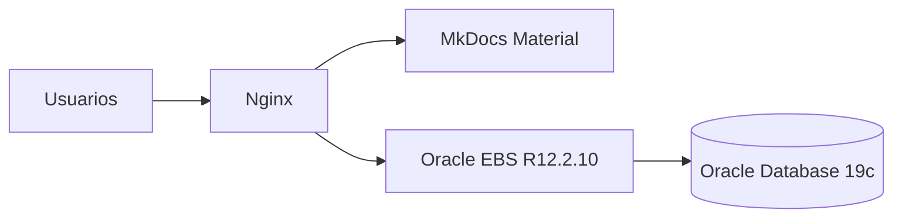

# Documentación Técnica

Bienvenido al portal de documentación de AixCorp.

Esta plataforma contiene documentación sobre:

- Oracle EBS R12.2.10
- Oracle Database 19c
- Linux
- Nginx
- Desarrollo e integraciones

---

## Arquitectura

---

## Secciones

01_instalacion/
    oracle_forms.md
    sql_developer.md

02_ebs/
    concurrent_programs.md
    xml_publisher.md
    bi_publisher.md

03_plsql/
    packages.md
    triggers.md

04_forms/
    desarrollo.md
    personalizations.md

05_troubleshooting/
    ora_errors.md
